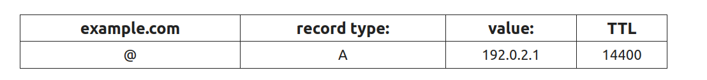
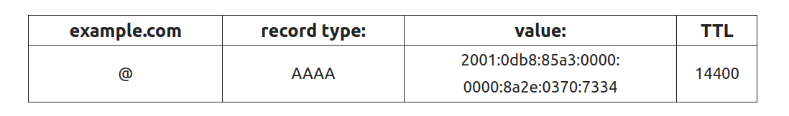
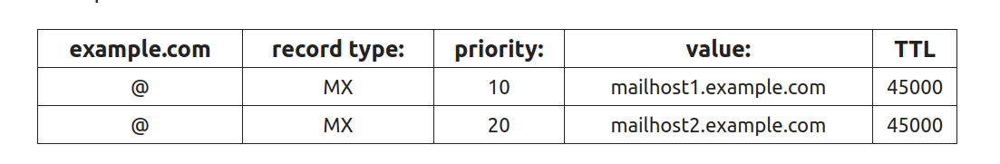
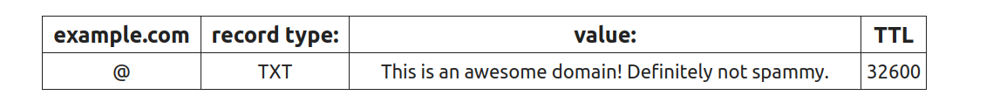
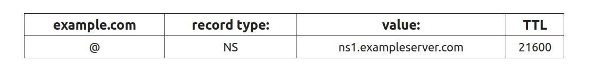
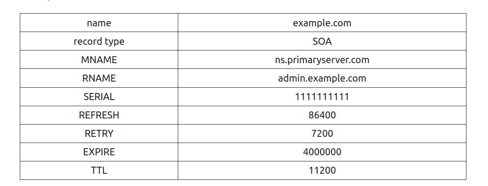
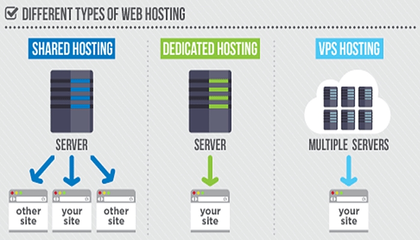

# **TASK 2 TRAINING**

1. <a href='#1'> SSL and related issues.
1. <a href='#2'> What is Domain?
1. <a href='#3'> What is DNS? Some records of DNS.
1. <a href='#4'> What is Hosting, VPS, Server?
1. <a href='#5'> Reverse proxy and operating principle.
2. <a href='#6'> Compare Nginx and Apache.  

***

## 1. SSL and related issues.

### What is SSL/TLS?

#### SSL
- SSL (Secure Sockets Layer) and its successor, TLS (Transport Layer Security), are protocols for establishing authenticated and encrypted links between networked computers. Although the SSL protocol was deprecated with the release of TLS 1.0 in 1999, it is still common to refer to these related technologies as “SSL” or “SSL/TLS.”
- SSL ensures that all data transmitted between web servers and browsers is private, separate.

#### TLS
- TLS (Transport Layer Security), released in 1999, is the successor to the SSL (Secure Sockets Layer) protocol for authentication and encryption.

#### SSL Certificate
- An SSL certificate (also known as a TLS or SSL/TLS certificate) is a digital document that binds the identity of a website to a cryptographic key pair consisting of a public key and a private key. The public key, included in the certificate, allows a web browser to initiate an encrypted communication session with a web server via the TLS and HTTPS protocols. The private key is kept secure on the server, and is used to digitally sign web pages and other documents (such as images and JavaScript files).
- An SSL certificate also includes identifying information about a website, including its domain name and, optionally, identifying information about the site’s owner. If the web server’s SSL certificate is signed by a publicly trusted certificate authority (CA), like SSL.com, digitally signed content from the server will be trusted by end users’ web browsers and operating systems as authentic.

### What is CA?
- CA is stand for Certificate Authority. CA is an organization that issues certificates of digital certificates for users, businesses, servers, code, and software. The digital certificate provider acts as a third party (trusted by both parties) to facilitate the secure exchange of information.

### How does SSL/TLS work?
- In order to provide a high degree of privacy, SSL encrypts data that is transmitted across the web. This means that anyone who tries to intercept this data will only see a garbled mix of characters that is nearly impossible to decrypt.
- SSL initiates an authentication process called a `handshake` between two communicating devices to ensure that both devices are really who they claim to be.
- SSL also digitally signs data in order to provide data integrity, verifying that the data is not tampered with before reaching its intended recipient.

### Some related to SSL

#### Domain Validation (DV SSL)
- The SSL digital certificate authenticates the Domain Name – Website. When a Website uses DV SSL, the domain name will be authenticated, the website has been securely encrypted when exchanging data.

#### Extended Validation (EV SSL)
- Show your customers that the Website is using the highest security SSL certificate and has been thoroughly legalized.

#### Subject Alternative Names (SANs SSL)
Multiple domain names merge in 1 digital certificate:
- A standard SSL digital certificate secures only one verified domain name. Option to add SANs with only single certificate to secure multiple subdomains. SANs bring flexibility to users, making it easier to install, use and manage SSL digital certificates.

#### Wildcard SSL Certificate (Wildcard SSL)
Ideal product for e-commerce portals. Each e-store is a sub-domain and is shared across one or more IP addresses. Then, to deploy a secure solution for online transactions (order, payment, registration & account login, ...) with SSL, we can use only one Wildcard digital certificate for the domain name. main website and all sub-domains.

### How a website check SSL?
- When the Website sends the browser an SSL certificate, the browser sends this certificate to a server that hosts the approved digital certificates. These servers are established by reputable companies such as GlobalSign, VeriSign.
- Technically, SSL uses public encryption. This technique helps the Website and the Browser to agree a set of keys to use during the subsequent information exchange.

- The key set will change each time in the next transaction, another person will not be able to decrypt it even with the data of the above digital certificate server.

## 2. What is Domain name?

### Domain
#### Define
- A domain name is a string of text that maps to a numeric IP address, used to access a website from client software. In plain English, a domain name is the text that a user types into a browser window to reach a particular website. For instance, the domain name for Google is **google.com**
- The actual address of a website is a complex numerical IP address (e.g. 103.21.244.0), but thanks to DNS, users are able to enter human-friendly domain names and be routed to the websites they are looking for. This process is known as a **DNS lookup**.

#### Domain && URL
- A **uniform resource locator** (URL), sometimes called a web address, contains the domain name of a site as well as other information, including the transfer protocol and the path. For example, in the URL **https://cloudflare.com/learning/’**, `cloudflare.com` is the domain name, while `https` is the protocol and `/learning/` is the path to a specific page on the website.

### What are the parts of a Domain name
- Domain names are typically broken up into two or three parts, each seperated by a dot. When read right-to-left, the indentifiers in domain names go from most general to most specific. The section to the right of the last dot in a domain name is the **top-level domain (TLD)**. These include the `generic` TLDs suc as `.com`, `.net` and `.org`, as well as country-specifics TLSs like `.uk` and `.jp`

- To the left of the TLD is the second-level domain (2LD) and if there is anything to the left of the 2LD, it is called the third-level domain (3LD). Let’s look at a couple of examples:

For Google’s US domain name, ‘google.com’:
- ’.com’ is the TLD (most general)
- ’google’ is the 2LD (most specific)

But for Google UK’s domain name, ‘google.co.uk’:
- ’.com’ is the TLD (most general)
- ’.co’* is the 2LD
- ’google’ is the 3LD (most specific)

## 3. What is DNS? Some record of DNS.

### What is DNS?
#### Define
- **The Domain Name System (DNS)** is the phonebook of the Internet. Humans access information online through domain names, like **facebook.com** or **google.com**. Web browsers interact through Internet Protocol (IP) addresses. DNS translates domain names to IP addresses so browsers can load Internet resources.
- Each device connected to the Internet has a unique IP address which other machines use to find the device. DNS servers eliminate the need for humans to memorize IP addresses such as 192.168.1.1 (in IPv4), or more complex newer alphanumeric IP addresses such as 2400:cb00:2048:1::c629:d7a2 (in IPv6)

#### How does DNS work?
- The process of DNS resolution involves converting a hostname (such as www.example.com) into a computer-friendly IP address (such as 192.168.1.1). An IP address is given to each device on the Internet, and that address is necessary to find the appropriate Internet device - like a street address is used to find a particular home. When a user wants to load a webpage, a translation must occur between what a user types into their web browser (example.com) and the machine-friendly address necessary to locate the example.com webpage.

### What is DNS record?
- DNS records (aka zone files) are instructions that live in authoritative DNS servers and provide information about a domain including what IP address is associated with that domain and how to handle requests for that domain. These records consist of a series of text files written in what is known as DNS syntax. 

- Each DNS record contains four main fields: **Type, Name, Data, and TTL**.

### Common types of DNS record
#### A record
- The **A** stands for "address" and this is the most fundamental type of DNS record: it indicates the IP address of a given domain. For example, if you pull the DNS records of google.com, the A record currently returns an IP address of: 142.250.66.110
- **A** records only hold IPv4 addresses. If a website has an IPv6 address, it will instead use an **AAAA** record.
- Here is an example of an A record
  

The **@** symbol in this example indicates that this is a record for the root domain, and the **14400** value is the TTL (time to live), listed in seconds. The default TTL for A records is 14,400 seconds. This means that if an A record gets updated, it takes 240 minutes (14,400 seconds) to take effect.

#### AAAA record
- DNS **AAAA** records match a domain name to an IPv6 address. DNS **AAAA** records are exactly like DNS A records, except that they store a domain's IPv6 address instead of its IPv4 address.

**Examples**

#### CNAME record
- The **‘canonical name’ (CNAME)** record is used in lieu of an **A** record, when a domain or subdomain is an alias of another domain. All **CNAME** records must point to a domain, never to an IP address. Imagine a scavenger hunt where each clue points to another clue, and the final clue points to the treasure. A domain with a **CNAME** record is like a clue that can point you to another clue (another domain with a CNAME record) or to the treasure (a domain with an A record).

- For example, suppose blog.example.com has a CNAME record with a value of ‘example.com’ (without the ‘blog’). This means when a DNS server hits the DNS records for blog.example.com, it actually triggers another DNS lookup to example.com, returning example.com’s IP address via its A record. In this case we would say that example.com is the canonical name (or true name) of blog.example.com.

- Oftentimes, when sites have subdomains such as blog.example.com or shop.example.com, those subdomains will have CNAME records that point to a root domain (example.com). This way if the IP address of the host changes, only the DNS A record for the root domain needs to be updated and all the CNAME records will follow along with whatever changes are made to the root.

#### MX record: 
- A DNS **mail exchange (MX)** record directs email to a mail server. The **MX** record indicates how email messages should be routed in accordance with the **Simple Mail Transfer Protocol (SMTP, the standard protocol for all email)**. Like CNAME records, an MX record must always point to another **domain**.

- The **priority** numbers before the domains for these MX records indicate preference; the lower **priority** value is preferred. The server will always try mailhost1 first because 10 is lower than 20. In the result of a message send failure, the server will default to mailhost2.

- The email service could also configure this MX record so that both servers have equal priority and receive an equal amount of mail. 

#### TXT record:
- The **DNS ‘text’ (TXT)** record lets a domain administrator enter text into the Domain Name System (DNS). The TXT record was originally intended as a place for human-readable notes. However, now it is also possible to put some machine-readable data into TXT records. One domain can have many TXT records.

- Today, two of the most important uses for DNS TXT records are email spam prevention and domain ownership verification, although TXT records were not designed for these uses originally.

#### NS record:
- NS stands for ‘nameserver,’ and the nameserver record indicates which DNS server is authoritative for that domain (i.e. which server contains the actual DNS records). Basically, NS records tell the Internet where to go to find out a domain's IP address. A domain often has multiple NS records which can indicate primary and secondary nameservers for that domain. Without properly configured NS records, users will be unable to load a website or application.

- A **nameserver** is a type of DNS server. It is the server that stores all DNS records for a domain, including **A records, MX records, or CNAME records**.

- Note that NS records can never point to a **canonical name (CNAME)** record.

#### SOA record:
- The DNS ‘start of authority’ (SOA) record stores important information about a domain or zone such as the email address of the administrator, when the domain was last updated, and how long the server should wait between refreshes.

- All DNS zones need an SOA record in order to conform to IETF standards. SOA records are also important for zone transfers.

**Example**

## 4. Hosting, VPS, Sever?

### Hosting

#### Define
- Web hosting is an online service that makes your website’s content accessible on the internet. When you purchase a hosting plan, you are renting space on a physical server to store all the website’s files and data.
- Web hosts provide the technology and resources required for the effective and secure operation of your website. They are responsible for keeping the server up and running, implementing security measures, and ensuring that data such as texts, photos, and other files are transferred successfully to the visitors’ browsers.'
  

#### How does web hosting work
- The server that hosts your website is a physical computer that runs continuously to make the site available for visitors all the time. Buying servers for web hosting will alow you to store all the data of your website in the those servers of your provider.

- Once a user enters your domain name into their browser’s address bar, the web host’s server will transfer all the files necessary to load your website.

#### Types of Web hosting Services

##### Share hosting 

- With shared hosting, multiple users share the same server resources, including memory, processing power, and storage space.

- Because of its simplicity and affordability, shared web hosting is an excellent solution for small businesses and personal websites that do not require advanced configuration or higher bandwidth. Hence, shared hosting is an excellent choice for beginners that need affordable hosting to start.

##### Virtual Private Server (VPS) Hosting

- With this web hosting type, your website also shares a physical server with other users, but the web host creates a virtual partition for each user. Thus, a site hosted on a virtual private server get an allocated amount of resources.
- VPS web hosting is a great option for medium-sized sites, eCommerce shops, and large blogs with a rapidly growing number of visitors.

##### Cloud Hosting

- This web hosting solution uses several virtual servers to host sites. Thus, if one server experiences high traffic or a problem, the remaining ones will take over and maintain the website operating.

- Since cloud hosting relies on a cluster of web servers to function, businesses with multiple websites and large-scale sites like eCommerce shops can benefit the most from it, as it provides little to no downtime.

##### WordPress Hosting
- This type of CMS web hosting service provides a WordPress-optimized server environment to help your site load faster and minimize potential issues. However, other types of web hosting still work for websites based on this popular content management system (CMS).

- Typically, the best WordPress hosting plans come with features such as pre-installed themes, plugins for core functions like caching and security, and other tools.

##### Dedicated Hosting 
- Dedicated hosting designates a physical server for each website. By going with dedicated hosting, you can configure the server, choose your desired operating system and software, and customize the entire hosting environment to your specifications.

Renting a dedicated server is just as powerful as having your own on-site server, but with the added benefit of getting professional support from your web host. Thus, dedicated hosting is ideal for large online businesses that deal with heavy traffic.