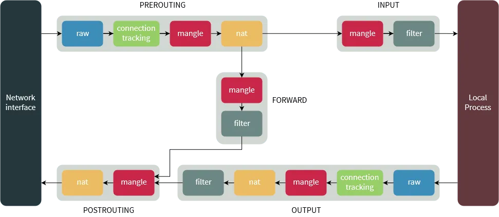
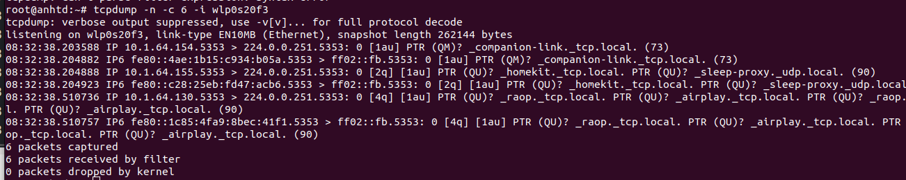
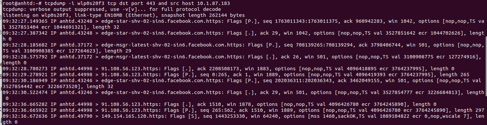

# **Task3_Training**

1. <a href='#1'> iptables packet flow diagram
2. <a href='#2'> Use module TRACE to follow flow of packet
3. <a href='#3'> Read iptables rules to debug
4. <a href='#4'> tcpdumps and another options to debug network

****

<div id='1'></div>

## 1. iptables packet flow diagram
- When a packet first enters the firewall, it hits the hardware and then gets passed on to the proper device driver in the kernel. Then the packet starts to go through a series of steps in the kernel, before it is either sent to the correct application (locally), or forwarded to another host - or whatever happens to it. 




### Tables && chains 

#### Raw tables:


- The raw table and its chains are used before any other tables in netfilter. Iptables is a stateful firewall, which means that packets are inspected with respect to their “state”. (For example, a packet could be part of a new connection, or it could be part of an existing connection.) The raw table allows you to work with packets before the kernel starts tracking its state. In addition, you can also exempt certain packets from the state-tracking machinery.
- The raw table contains two chains. The PREROUTING and OUTPUT chain, where they will handle packets before they hit any of the other netfilter subsystems. The PREROUTING chain can be used for all incoming packets to this machine, or that are forwarded, while the OUTPUT chain can be used to alter the locally generated packets before they hit any of the other netfilter subsystems. 

#### Mangle tables: 


This table is used to mangle (modify) packets. It is primarily used for changing these fields in a packet and is not to be used for filtering or any sort of NATing. It has the following actions/ targets:
- TOS (Type of Service)
- TTL (Time To Live)
- MARK 

This table has chains everywhere. You can mangle during:
- PREROUTING (as a packet enters the host): is used for altering packet just as they enter the firewall and before hit the routing decision. 
- OUTPUT (or for a packet generated by the host): is used for altering locally generated packets after they enter the routing decision.
- INPUT (a packet destined for this host): is used to alter packets after they have been routed to the local computer itself, but before the user space application actually sees the data.
- FORWARD (a packet being forwarded via this host: is used to mangle packets after they have hit the first routing decision, but before they actually hit the last routing decision
- POSTROUTING (as a packet leaves the host): is used to mangle packets just after all routing decisions have been made.

**Examples:**
```
## mark packets to port 22
iptables -t mangle -A PREROUTING -p tcp --dport 22 -j MARK --set-mark 2

## restore the packet's mark from that of the connection
iptables -A POSTROUTING -t mangle -j CONNMARK --restore-mark
 
## if the packet's mark is not 0 accept it
iptables -A POSTROUTING -t mangle -m mark ! --mark 0 -j ACCEPT
 
## once accepted, set a mark of 1 or 2 on the packet depending on the destination port
iptables -A POSTROUTING -p tcp --dport 21 -t mangle -j MARK --set-mark 1
iptables -A POSTROUTING -p tcp --dport 80 -t mangle -j MARK --set-mark 2
 
## now save this mark to the connection itself
iptables -A POSTROUTING -t mangle -j CONNMARK --save-mark
```

#### NAT tables


This table is only used to perform NAT operations. Only the first packet in a stream of packets hits this table, and al subsequent packets of that stream follow whatever is determined with the first packet. You can do the following:
- SNAT (what we typically think of with NAT – you have a public IP, behind which is a network of private IPs, you want the machines in this private IP network to be able to access the public Internet but since their IPs are private these networks are not routable and so you hide them all behind the public IP; as far as the outside world is concerned all traffic of all the machines in your private network originate from/ are destined to this public IP) (SNAT == Source NAT; source being your private network from where traffic originates and whose real source IP gets changed by this table) 
    - MASQUERADE (a special case of SNAT wherein you don’t need to specify the public IP, Iptables will use the source address of the outgoing interface; useful when your public IP could change and you don’t want to specify it)
- DNAT (the opposite of the above; you have some server in your private IP space and since this is not routable on the Internet you want requests hitting your public IP to be sent to this server instead, so you are rewriting the destination address whereas with SNAT you are rewriting the source address; this is not the same as port forwarding but you can use DNAT to do port forwarding too). In a simple way, DNAT help server outside (ip/port public) get to server inside (ip/port private).

**Examples:**

**SNAT&MASQUERADE**
```
## Change source addresses to 1.2.3.4.
iptables -t nat -A POSTROUTING -o eth0 -j SNAT --to 1.2.3.4
 
## Change source addresses to 1.2.3.4, 1.2.3.5 or 1.2.3.6
iptables -t nat -A POSTROUTING -o eth0 -j SNAT --to 1.2.3.4-1.2.3.6
 
## Change source addresses to 1.2.3.4, ports 1-1023
iptables -t nat -A POSTROUTING -p tcp -o eth0 -j SNAT --to 1.2.3.4:1-1023
 
## Masquerade everything out ppp0.
iptables -t nat -A POSTROUTING -o ppp0 -j MASQUERADE
```
Note that SNAT & MASQUERADE are always in the POSTROUTING chain. Because it happens as the packets are exiting the machine. It is the last step before the packets exit.


**DNAT & REDIRECT**
```
## Change destination addresses to 5.6.7.8
iptables -t nat -A PREROUTING -i eth0 -j DNAT --to 5.6.7.8
 
## Change destination addresses to 5.6.7.8, 5.6.7.9 or 5.6.7.10.
iptables -t nat -A PREROUTING -i eth0 -j DNAT --to 5.6.7.8-5.6.7.10
 
## Change destination addresses of web traffic to 5.6.7.8, port 8080.
iptables -t nat -A PREROUTING -p tcp --dport 80 -i eth0 -j DNAT --to 5.6.7.8:8080

```

Note that DNAT & REDIRECT happen in the PREROUTING chain, before any filtering but after any actions by the Raw and Mangle tables.


#### Filter table
- The filter table should be used exclusively for filtering packets. For example, we could DROP, LOG, ACCEPT or REJECT packets without problems, as we can in the other tables. There are three chains built in to this table. 
  - FORWARD is used on all non-locally generated packets that are not destined for our local host (the firewall, in other words). 
  - INPUT is used on all packets that are destined for our local host (the firewall)
  - OUTPUT is finally used for all locally generated packets. 


***

### Targets 
- As we’ve mentioned before, chains allow you to filter traffic by adding rules to them. So for example, you could add a rule on the filter table’s INPUT chain to match traffic on port 22. But what would you do after matching them? That’s what targets are for — they decide the fate of a packet.
- The most commonly used terminating targets are:
    - ACCEPT: This causes iptables to accept the packet.
    - DROP: iptables drops the packet. To anyone trying to connect to your system, it would appear like the system didn’t even exist.
    - REJECT: iptables “rejects” the packet. It sends a “connection reset” packet in case of TCP, or a “destination host unreachable” packet in case of UDP or ICMP.


### Traversing of packet in situation:

#### Packet destination IP is IP server (local host)

##### Step 1
- Packet from the wire outside (Internet, ....)

##### Step 2
- Packet comes in on the interface (eth0, ...)

##### Step 3
- **Tables:** raw 
- **Chain:** PREROUTING
- **Infor:** This chain is used to handle packets. To control the state of the connection before the kernel starting tracking its state (new or existing connection). And after that, the connection tracking code takes place.

##### Step 4:
- **Tables:** mangle
- **Chain:** PREROUTING
- **Infor:** mangling the packets ex: TTL, TOS,...

##### Step 5: 
- **Tables:** nat 
- **Chain:** PREROUTING
- **Infor:** It will use DNAT to translate public ip/port to private ip/port. Avoid filtering in this chain since it will be bypassed in certain cases.

##### Step 6: 
- Routing decision: is the packet destination for our local host or to be forwarded and where
  

##### Step 7:
- **Tables:** mangle
- **Chain:** INPUT
- **Infor:** We use this chain to mangle packets, after they have been routed, but before they are actually sent to the process on the machine.

##### Step 8:
- **Tables:** Filter
- **Chain:** INPUT
- **Infor:** This is where we do filtering for all incoming traffic destined for our local host.

##### Final step:
- Local process or application (server, client program,....)


#### Packet from local to outside

##### Step 1:
- Local process/application. Routing decision. What source address to use, what outgoing interface to use, and other necessary information that needs to be gathered.
##### Step 2: 
- **Tables:** raw
- **Chain:** OUTPUT
- **Infor:** This is where you do work before the connection tracking has taken place for locally generated packets. You can mark connections so that they will not be tracked for example. After that, connection tracking will takes places for locally generated packets.
  
##### Step 3:
- **Tables:** mangle
- **Chain:** OUTPUT
- **Infor:** This is where we mangle packets, it is suggested that you do not filter in this chain since it can have side effects.

##### Step 4:
- **Tables:** nat 
- **Chain:** OUTPUT
- **Infor:** This chain can be used to NAT outgoing packets from the firewall itself. Next, Routing decision, since the previous mangle and nat changes may have changed how the packet should be route.

##### Step 5:
- **Tables:** filter
- **Chain:** OUTPUT 
- **Infor:** This is where we filter packets going out from the local host.

##### Step 6:
- **Tables:** mangle
- **Chain:** POSTROUTING
- **Infor:** The POSTROUTING chain in the mangle table is mainly used when we want to do mangling on packets before they leave our host, but after the actual routing decisions. This chain will be hit by both packets just traversing the firewall, as well as packets created by the firewall itself.

##### Step 7:
- **Tables:** nat 
- **Chain:** POSTROUTING
- **Infor:** This is where we do SNAT as described earlier. It is suggested that you don't do filtering here since it can have side effects, and certain packets might slip through even though you set a default policy of DROP. Finally, it goes out on some interface, and comes on the wire, Internet.
  

#### Forwarded packets
##### Step 1
- Process/Apllication on the wire. After that comes in on the interface (eth0,...)

##### Step 2
- **Tables:** raw
- **Chain:** PREROUTING
- **Infor:** Here you can set a connection to not be handled by the connection tracking system.

##### Step 3
- **Tables:** mangle
- **Chain:** PREROUTING
- **Infor:** mangling the packet (TOS, TTL, mark, ...)

##### Step 4
- **Tables:** nat
- **Chain:** PREROUTING
- **Infor:** This chain is used for DNAT mainly. SNAT is done further on. Avoid filtering in this chain since it will be bypassed in certain cases. After that, routing decision.
  
##### Step 5
- **Tables:** mangle 
- **Chain:** FORWARD
- **Infor:** The packet is then sent on to the FORWARD chain of the mangle table.

##### Step 6:
- **Tables:** filter
- **Chain:** FORWARD
- **Infor:** The packet gets routed onto the FORWARD chain. Only forwarded packets go through here, and here we do all the filtering. Note that all traffic that's forwarded goes through here (not only in one direction), so you need to think about it when writing your rule-set.


##### Step 7
- **Tables:** mangle 
- **Chain:** POSTROUTING
- **Infor:** This chain is used for specific types of packet mangling that we wish to take place after all kinds of routing decisions have been done, but still on this machine.

##### Step 8
- **Tables:** nat
- **Chain:** POSTROUTING
- **Infor:** This chain should first and foremost be used for SNAT. Avoid doing filtering here, since certain packets might pass this chain without ever hitting it. This is also where Masquerading is done. Finally, it goes out on the outgoing interface and out on the wire.


*********

<div id='2'></div>

## 2. Use module TRACE to follow flow of packet


<div id='3'></div>

## 3. Read iptables rules to debug

### iptables options:
```
| Parameter         | Description |
| ------------------| ----------------------------------------------|
| -p, --protocol    |  The protocol, such as TCP, UDP, etc.               |
| -s, --source      |  Can be an address, network name, hostname, etc.    |
| -d, --destination |  An address, hostname, network name, etc.           |
| -j, --jump        |  Specifies the target of the rule; i.e. what to do if the packet matches. |
| -s, --source      |  Can be an address, network name, hostname, etc.    |
| -s, --source      |  Can be an address, network name, hostname, etc.    |


```


### Allow/Block IP X access to IP dest A.B.C.D port YYY

#### Allow 
```
iptables -A INPUT -p tcp -s IP_X -d A.B.C.D -dport YYY -j ACCEPT
```

#### Block
```
iptables -A INPUT -p tcp -s IP_X -d A.B.C.D -dport YYY -j DROP
```

### Allow/Block new IP access to IP dest A.B.C.D port YYY
#### Allow
```
iptables - A INPUT -p tcp --state NEW -d A.B.C.D -dport YYY -j ACCEPT
```


<div id='4'></div>

## 4. tcpdump and another options to debug network

### tcpdump

Tcpdump is a command line utility that allows you to capture and analyze network traffic going through your system. It is often used to help troubleshoot network issues, as well as a security tool.

### Flag in tcpdump

              **TCPDUMP FLAGS**
URG  =  (Not Displayed in Flag Field, Displayed elsewhere) 
ACK  =  (Not Displayed in Flag Field, Displayed elsewhere)
PSH  =  [P] (Push Data)
RST  =  [R] (Reset Connection)
SYN  =  [S] (Start Connection)
FIN  =  [F] (Finish Connection)
SYN-ACK =  [S.] (SynAcK Packet)
         [.] (No Flag Set)
  

**Examples:**
1. Display Available Interfaces


2. Capture Packets from Specific Interface
The command screen will scroll up until you interrupt and when we execute the tcpdump command it will captures from all the interfaces, however with -i switch only capture from the desired interface.
```
tcpdump -i interface_name
```


3. Capture Only Number of Packets
When you run the tcpdump command it will capture all the packets for the specified interface, until you hit the cancel button. But using **-c** option, you can capture a specified number of packets. The below example will only capture 6 packets.


4. Capture and Save Packets in a File


**Read the packet file:**


5. Capture IP Address Packets



6. Capture only TCP Packets.


7. Capture Packets from source IP
- To capture packets from **source IP**, say you want to capture packets for **10.1.87.183**, use the command as follows.


** Capture Packets from destination IP


8. Capture the packet that outbound port 443 and from source IP




9. Isolate all SYN packets
``` 
tcpdump 'tcp[13]&2!=0'
tcpdump 'tcp[tcpflags]==tcp-syn'
tcpdump -n tcp and port 80 and 'tcp[tcpflags] & tcp-syn == tcp-syn'
tcpdump tcp and port 80 and 'tcp[tcpflags] == tcp-syn'
tcpdump -i <interface> "tcp[tcpflags] & (tcp-syn) != 0"
```


 
