# **Task4**

1. <a href='#1'> LAMP stack: wordpress and laravel in centos7 and Vhost
2. <a href='#2'> LEMP stack: wordpress and laravel in ubuntu 20.04


****

<div id='1'></div>

## **1. LAMP stack: wordpress and laravel in centos 7**

### Wordpress 
**Step 1: Install the Apache Web Server** 

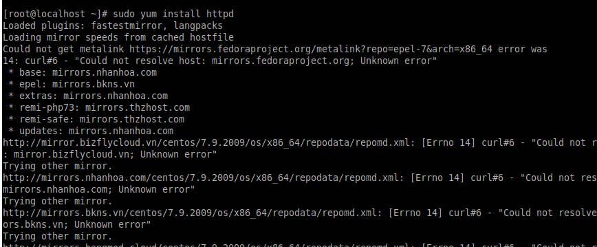

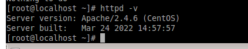

1. Next, start Apache by running the following command:
```
sudo systemctl start httpd.service
```
2. Check whether the service is running by going to your server’s public IP address. The browser should display the test CentOS 7 Apache web page:

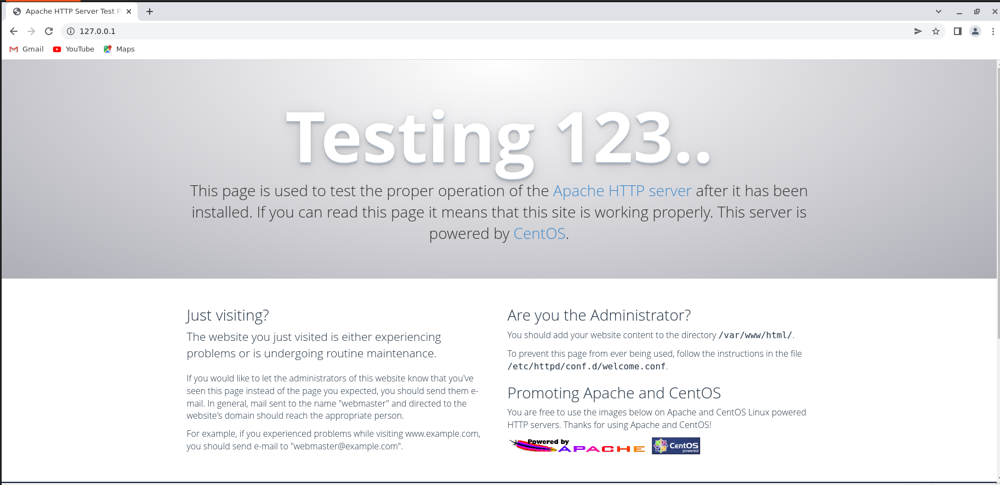

3. Finnaly, start httpd service to start at boot
```
sudo systemctl enable httpd.service
```

**Step 2: Install MariaDB and Create Database:**
1. Install MariaDB with the command:
```
sudo yum install mariadb-server mariadb
```
2. Now start MariaDB using the command:
```
sudo systemctl start mariadb
```
3. Check version of mariadb service:

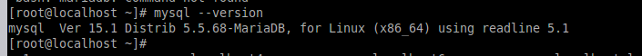

**Step 4: Run MySQL Security Script**
MariaDB does not have secure settings by default. Therefore, you need to configure settings, test the database, and remove anonymous users.
```
sudo mysql_secure_installation
```
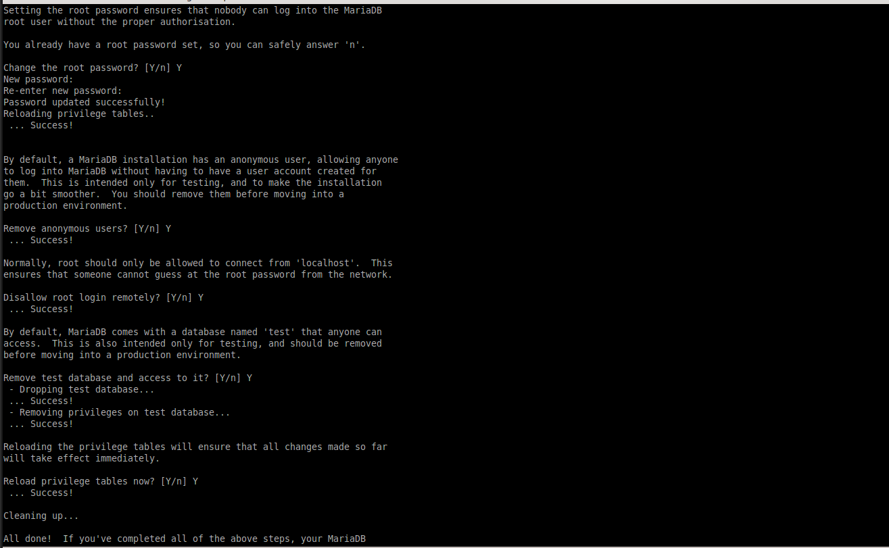

1. You will be prompted to provide your MariaDB root password (this is not the root password for your server). As you do not have a password yet, pressing Enter allows you to continue configuration.

2. Next, it will ask you a series of queries. To ensure your database is protected, answer the questions as follows:
- Set root password? [y/n] Y
- New password: Type in a password you would like to use
- Re-enter new password: Retype the password from the previous field
- Remove anonymous users? [y/n] Y
- Disallow root login remotely? [y/n] Y
- Remove test database and access to it? [y/n] Y
- Reload privilege tables now? [y/n] Y

3. Lastly, enable MariaDB to start up when you boot the system:
```
sudo systemctl enable mariadb.service
```

4. When you’re finished, log in to the MariaDB console by entering:
```
mysql -u root -p 
```
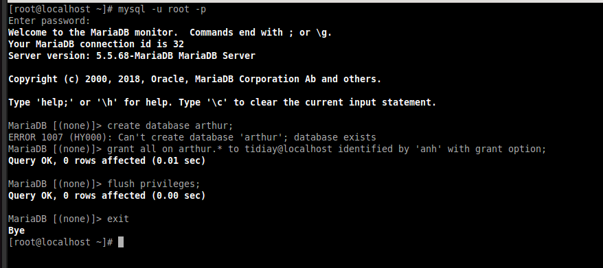


**Step 5: Download and install php:**
1. 
```
sudo yum install php php-mysql
```

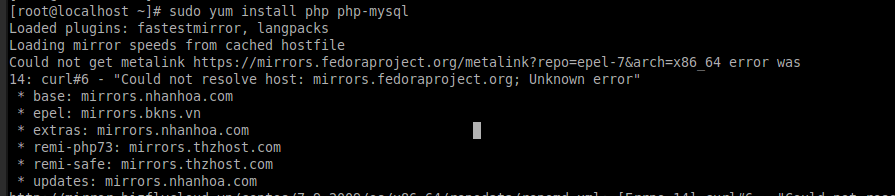

1. Change the ownership of the default Apache document root to your user and group:
```
sudo chown -R tidiay:tidiay /var/www/html/
```

**Step 6: Download Wordpress:**

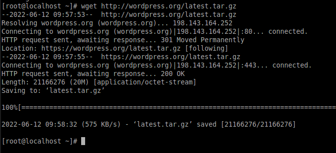

2. After download, use **tar -xzvf** to unzip tar file. That should create a file named WordPress in our home directory. Next, we want to move that file and its contents to our public_html folder, so it can serve up the content for our website. We want to keep the same file permission, so we use the following rsync command. 

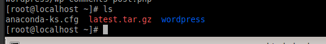

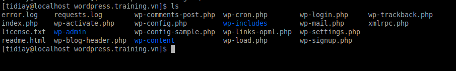

3. For WordPress to be able to upload files, we need to create an uploads directory. Go ahead and use the following:
```
mkdir /var/www/html/wordpress/wp-content/uploads
```

4. Lastly, update the Apache permissions for new WordPress files 
```
sudo chown -R tidiay:tidiay /var/www/html/*
```

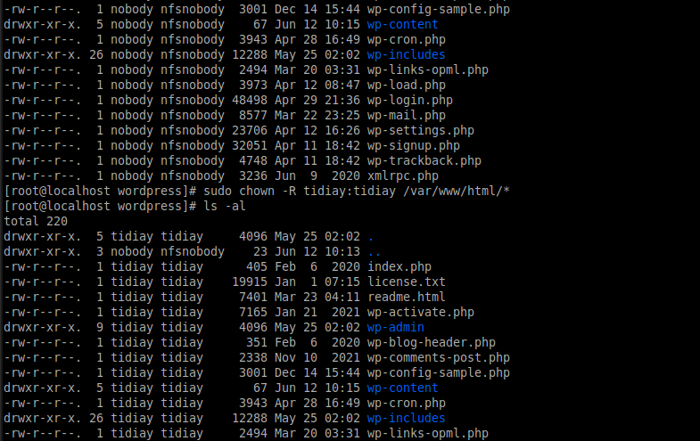

**Step 7: Configuring WordPress**
1. Create a wp-config.php file by copying the sample file WordPress has provided. 
``` 
cp wp-config-sample.php wp-config.php
```

After that config this file with your database:

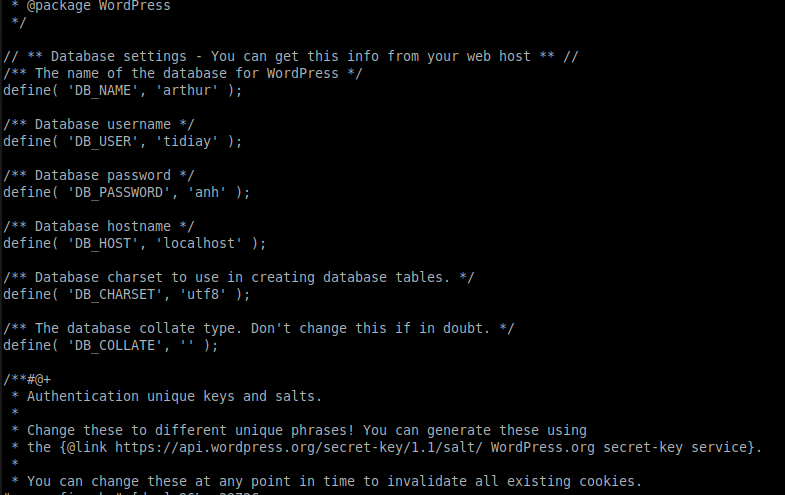

#### Setup VHost
1. Config file http.conf in **/etc/httpd/conf/**

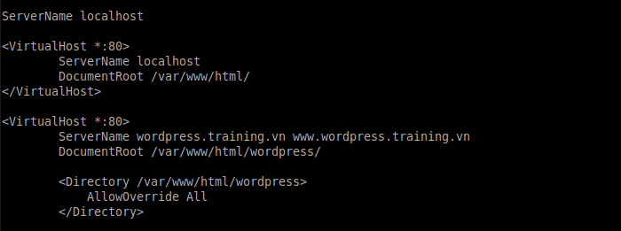

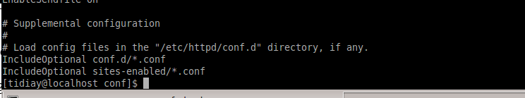

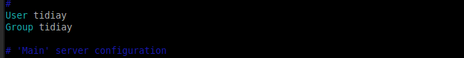

2. Create 2 file sites-available and sites-enabled 
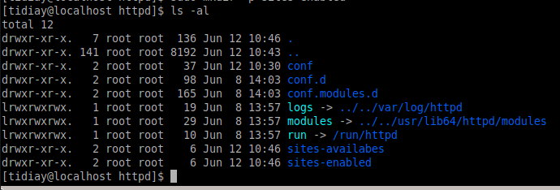

3. Create file config vhost in /etc/httpd/sites-availabe/

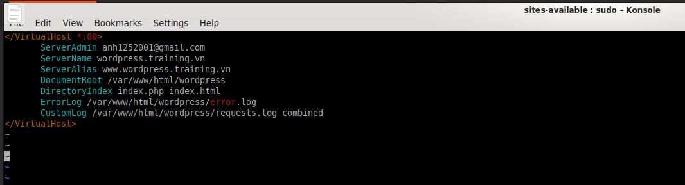

4. After that, create symlink to /etc/httpd/sites-enabled/

#### Finish and go to you website to check

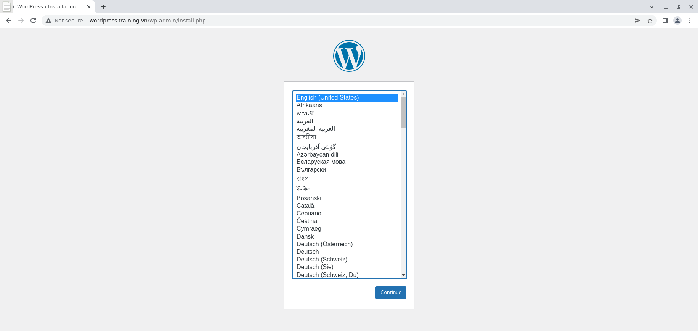


### Laravel
1. Setup Yum Repositories
First, we need to add the REMI and EPEL rpm repositories in your system. These repositories contain the updated packages. You can use the following commands to set up the rpm repositories
```
rpm -Uvh https://dl.fedoraproject.org/pub/epel/7/x86_64/Packages/e/epel-release-7-12.noarch.rpm
rpm -Uvh http://rpms.famillecollet.com/enterprise/remi-release-7.rpm
```
2. Setup LAMP (finished)
3. Setup Composer
Composer is a command-line program that installs packages and libraries available on the packagist.org repository – Composer's main repository.
Composer is a very useful tool for developers when they need and want to manage and combine packages for their PHP project.

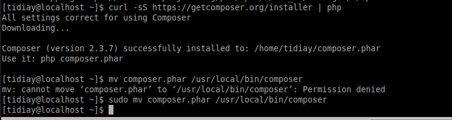

4. Setup Laravel with Git

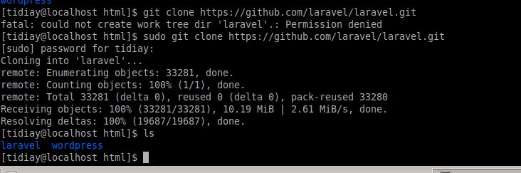

Install php8.1.7 and extension 

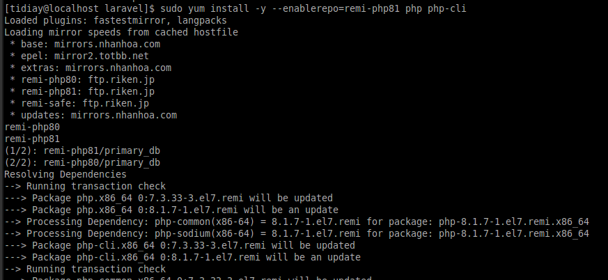

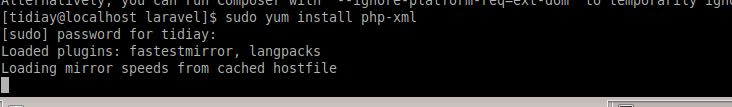

**Remember to change owner of file laravel**

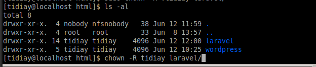

- Set encryption key

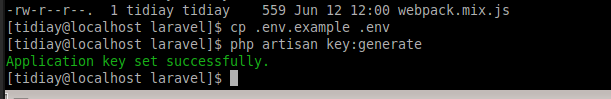

- Update composer: 

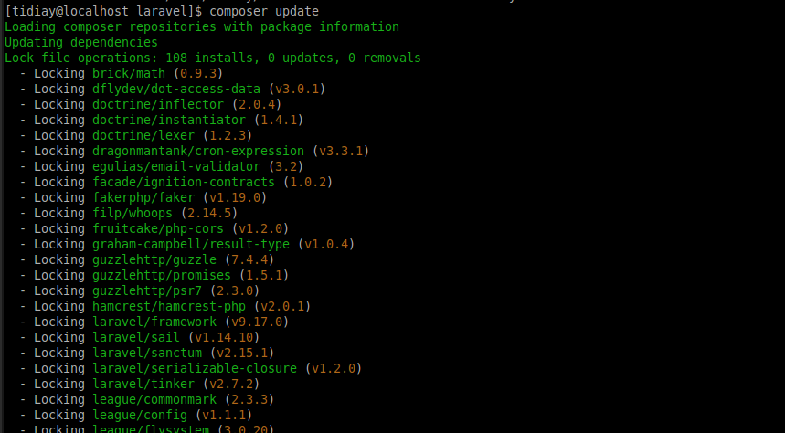

- Install laravel:

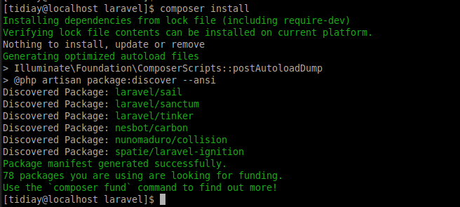


#### Setup VHost (Same with wordpress)

- Config file **/etc/httpd/conf/httpd.conf**
  
 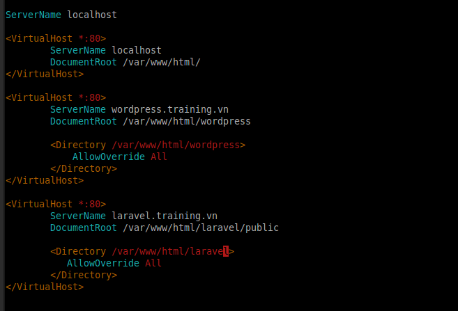

- Create new file **laravel.training.vn** in /etc/httpd/sites-available/ and config:
  
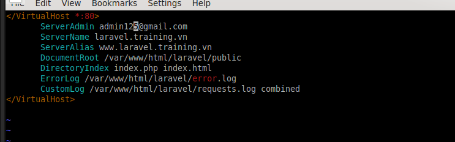

- After that, create symlink to sites-enabled 

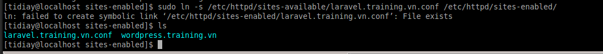

- Edit file /etc/hosts to add your domain

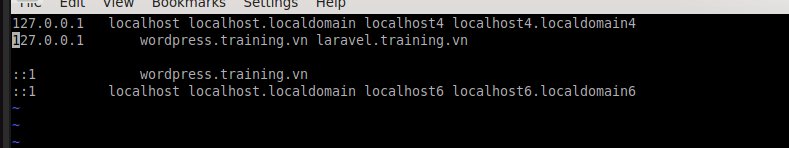


#### Finish and go to website to check:

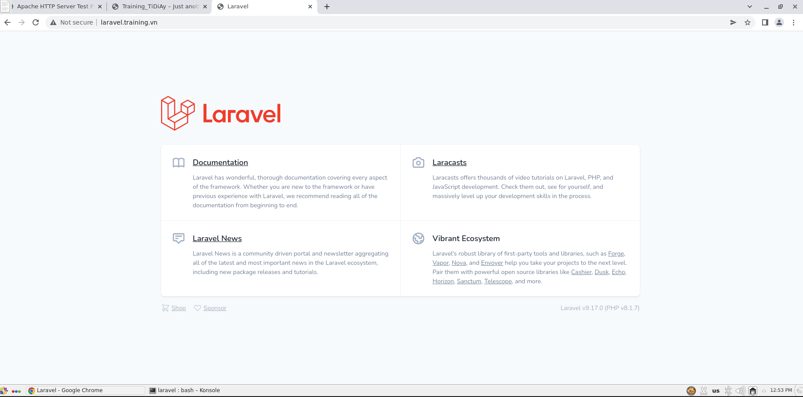


<div id='2'></div>

## **2. LEMP stack: wordpress and laravel in ubuntu 22.04**

### LEMP stack, wordpress and vhost in ubuntu 22.04

1. Update sudo and Install nginx 

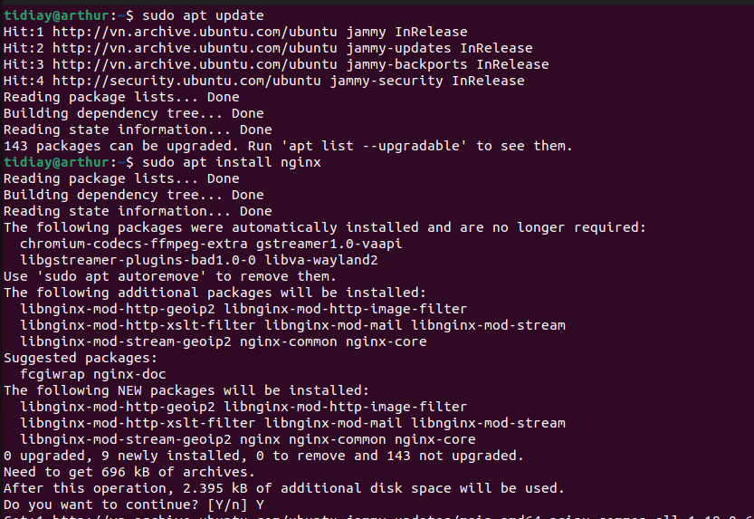

- If you have the ufw firewall enabled, as recommended in our initial server setup guide, you will need to allow connections to Nginx. Nginx registers a few different UFW application profiles upon installation. To check which UFW profiles are available, run:

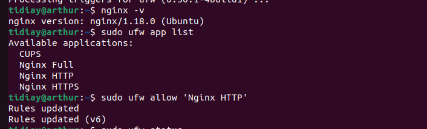

- Check status ufw:
  
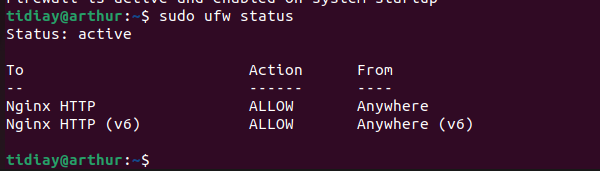

2. Install MySQL
```
sudo apt install mysql-server
sudo mql_secure_installation
```

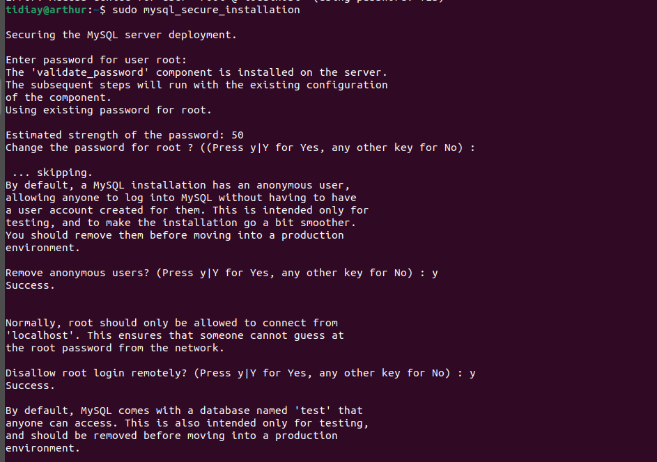

- Then config mysql in wordpress folder:
  
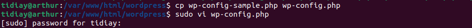

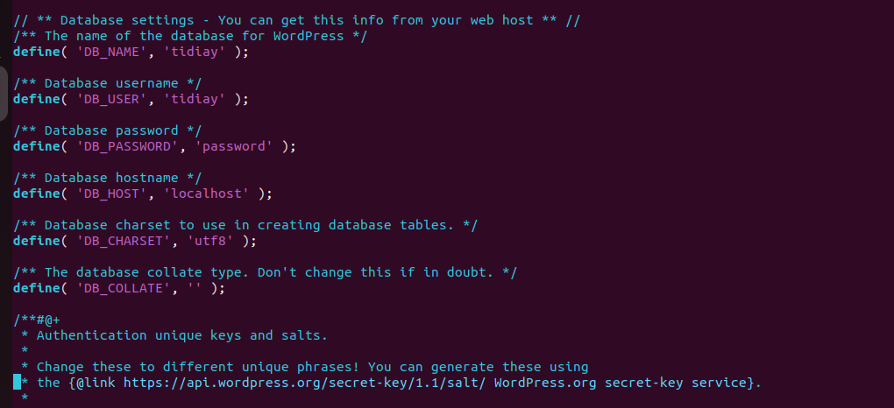


3. Install PHP

```
sudo apt install php8.1-mysql php8.1-curl php8.1-xml php8.1-cli
```

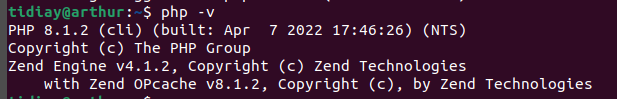

**Config file /etc/php/8.1/fpm/pool.d/www.conf**

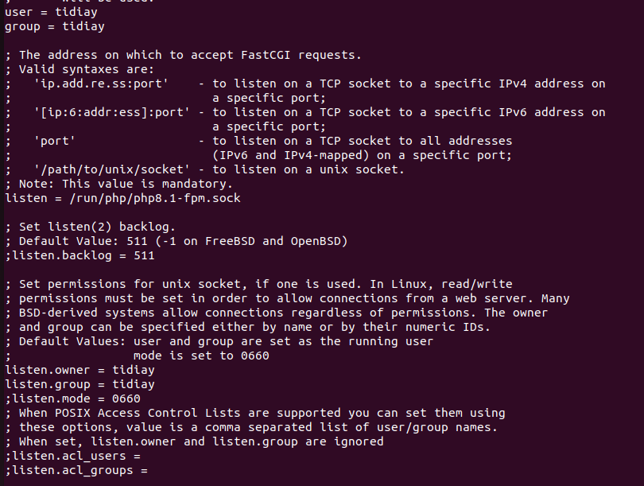

4. Configuring Nginx to Use the PHP Processor

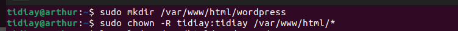

Then, open a new configuration file in Nginx’s sites-available directory using your preferred command-line editor.
```
sudo vim /etc/nginx/sites-available/wordpress.training.vn.conf
```
And config this file like that:

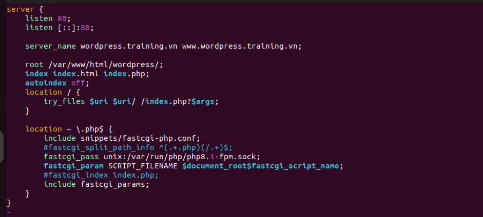

Activate your configuration by linking to the configuration file from Nginx’s sites-enabled directory:

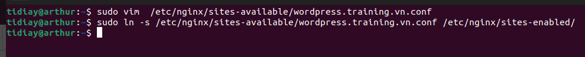

5. Download and install wordpress:
```
wget https://wordpress.org/latest.zip
```

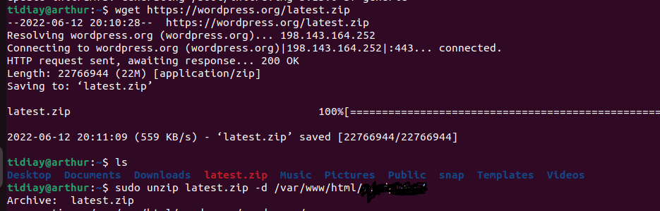


- Test nginx and restart nginx service:

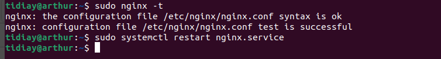

- Finally, edit file /etc/hosts
  
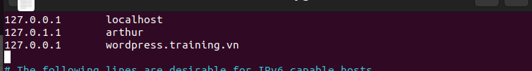

- Go to website and check the result:

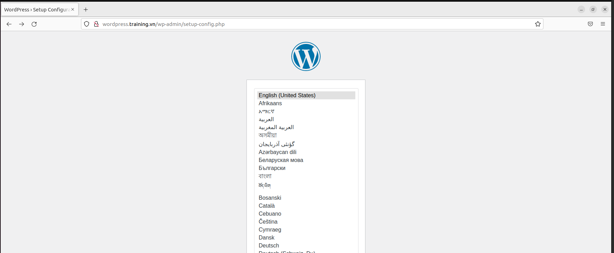


<div id='2'></div>

### Laravel 
We already installed LEMP on Ubuntu 22.04. Now we will install Laravel and Vhost.

1. Create new database:
```
sudo mysql -u root -p
```
After create new database, we install composer: 
```
curl -sS https://getcomposer.org/installer | php
sudo mv composer.phar /usr/local/bin/composer
sudo chmod +x /usr/local/bin/composer
```

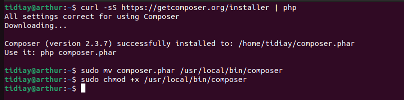

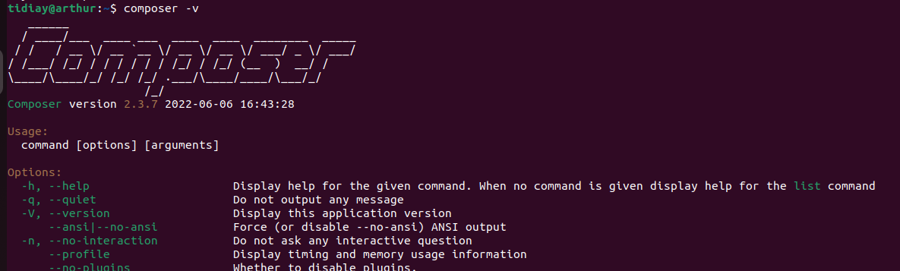

2. Download and install Laravel

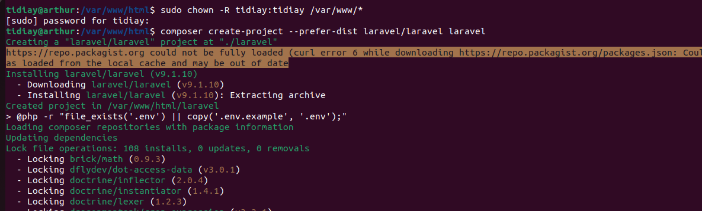

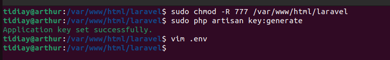


3. Config VHost:

- First, create new file **laravel.training.vn.conf** in /etc/nginx/sites-available/ and write: 


- Create symlink to /etc/nginx/sites-enabled/
  


- Edit file /etc/hosts


4. Finished
- Go to your website with your domain and check
  
