# Task 5 

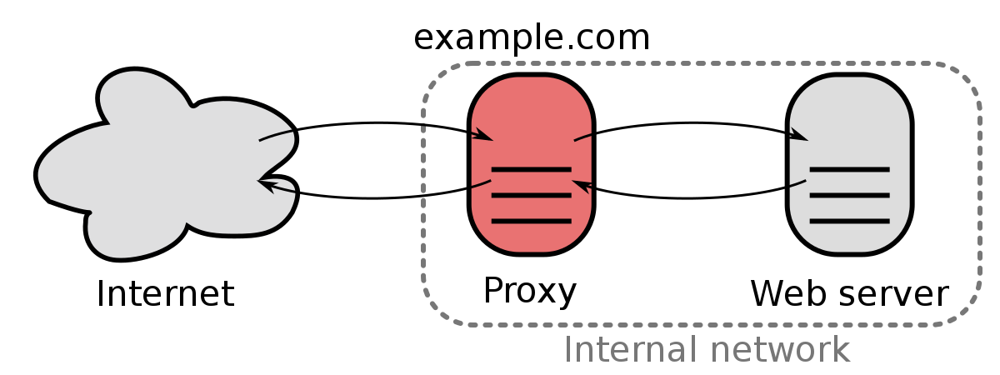

1. <a href='#1'> Reverse-proxy
2. <a href='#2'> MySQL (remote)
3. <a href='#3'> VSFTPD
4. <a href='#4'> phpMyAdmin 


***********

<div id='1'></div>

# 1. Reverse-proxy

1. Download and config nginx as a reverse proxy 
- In Nginx, create and edit file reverse-proxy to act as a reverse proxy between Apache host server and my local machine.
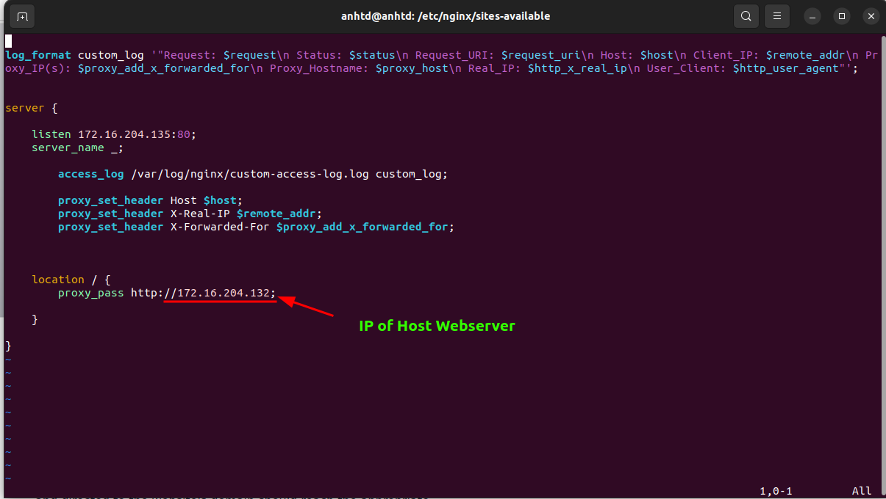

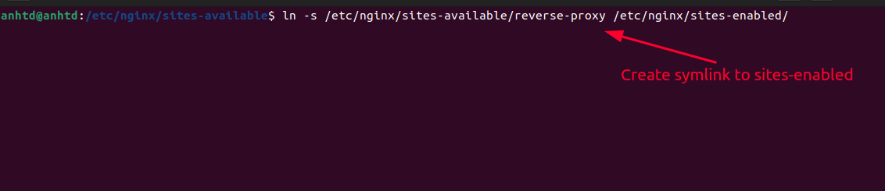

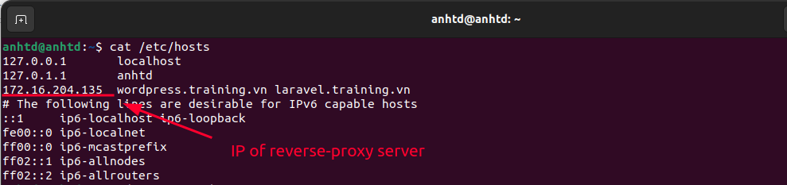

<div id='2'></div>

# 2. Install MySQL (remote)
- Install MySQL with wget command
```
sudo wget https://dev.mysql.com/get/mysql80-community-release-el7-3.noarch.rpm
```

- To update the software repositories, use the command:
``` 
sudo rpm -ivh mysql80-community-release-el7-3.noarch.rpm
```

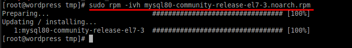

- Install MySQL on CentOS:
```
sudo yum install mysql-server
```

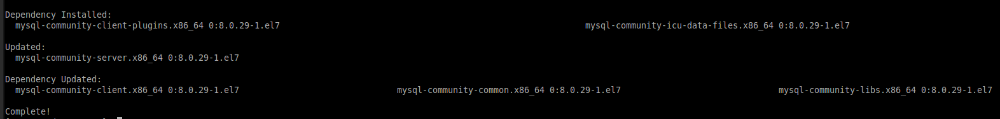

- To launch MySQL from the command line, use the command:
```
mysql -u root -p
```
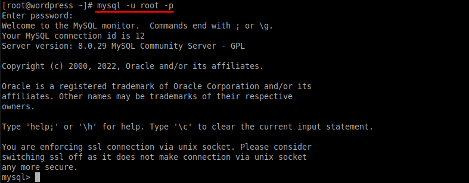

- Create new database for wordpress and laravel:

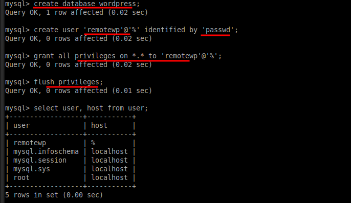


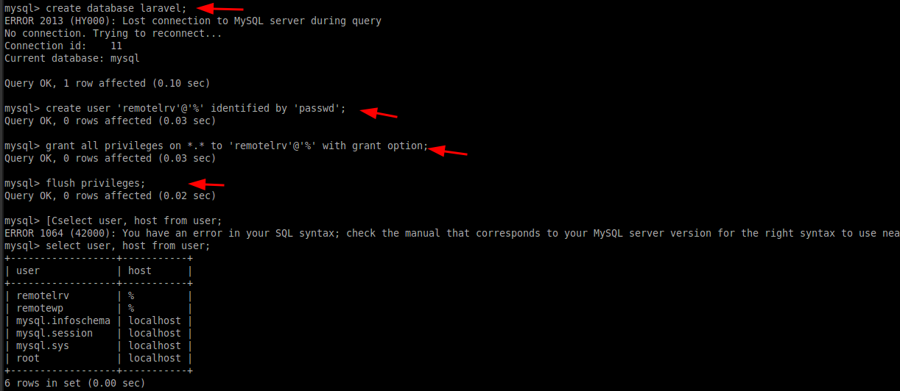

- Edit File configure data of **wordpress** 
```
vi /var/www/html/wordpress/wp-config.php
```

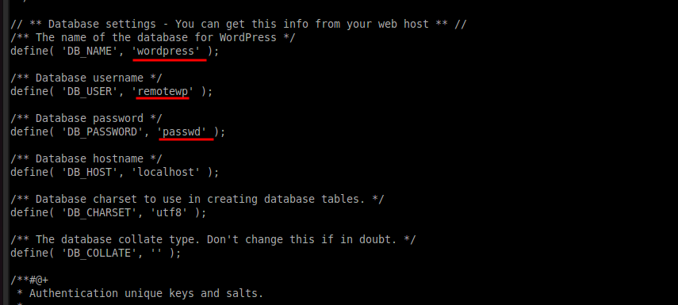

- Edit file configure database of **laravel**
```
vi /var/www/html/laravel/.env
```

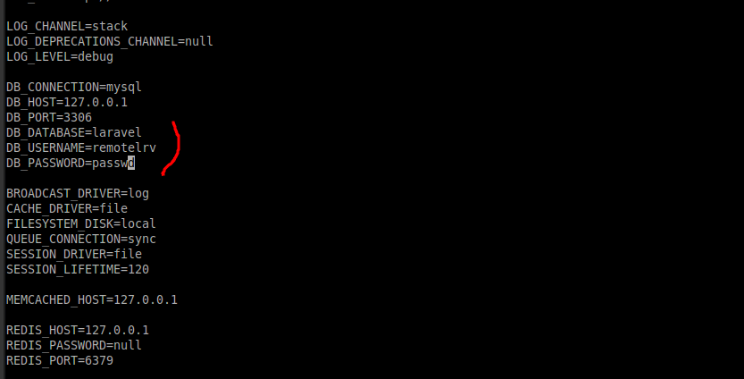


- Enable remote MySQL in CentOS 7
```
vi /etc/my.cnf
```

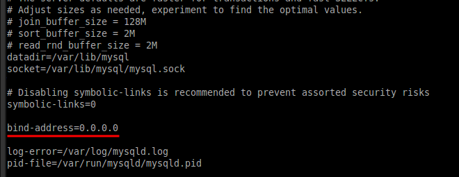

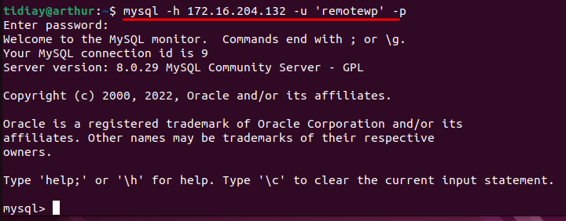

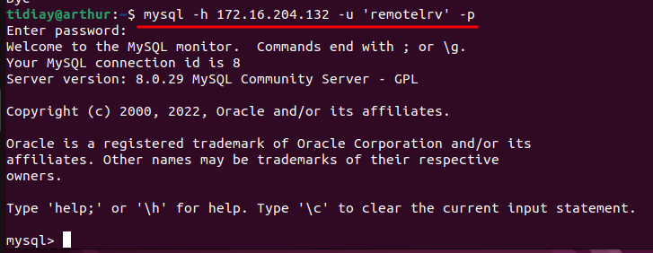


<div id='3'></div>

# 3. vsftpd

- Install vsftpd with command line in CentOS 7:
``` 
sudo yum install vsftpd

```

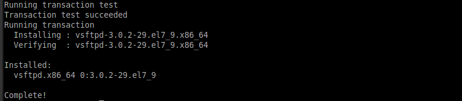

- Start the service and set it to launch when the system boots with the following:
```
sudo systemctl start vsftpd
sudo systemctl enable vsftpd

```

-  Next, create a rule for your firewall to allow FTP traffic on Port 21:
```
sudo firewall-cmd --zone=public --permanent --add-port=21/tcp
sudo firewall-cmd --zone=public --permanent --add-service=ftp
sudo firewall-cmd --reload
```

- Configuring VSFTPD:
```
sudo cp /etc/vsftpd/vsftpd.conf /etc/vsftpd/vsftpd.conf.default
sudo vi /etc/vsftpd/vsftpd.conf
```

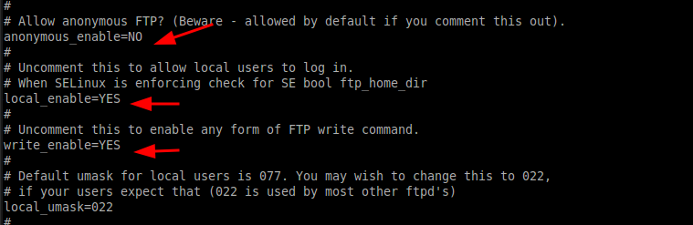
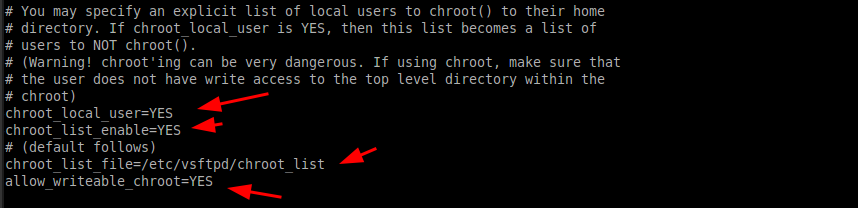
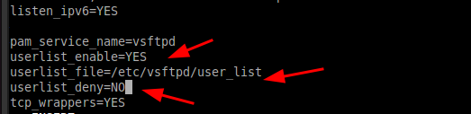

- Add user into /etc/vsftpd/user_list file and create new folder to upload file:

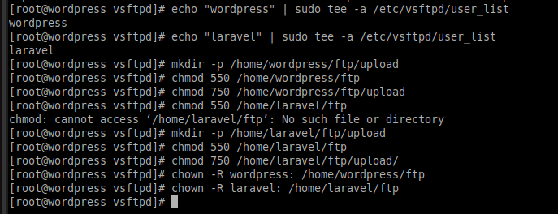

- Create /etc/vsftpd/chroot_list and add user into it:

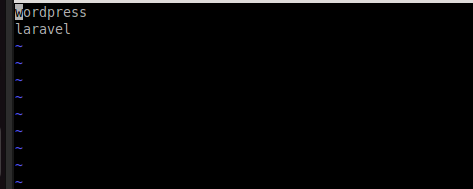

- Use another VM and access ftp into laravel user in host server:
  
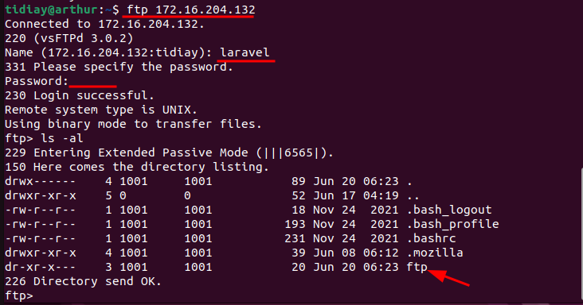


# 4. phpMyAdmin:
- Install phpMyAdmin with command line in CentOS 7:

```
sudo yum install phpmyadmin
```

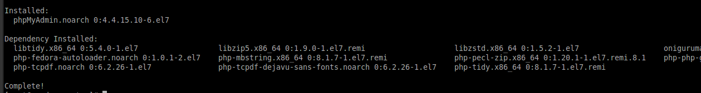

