# **LINUX_TRAINING**
 

1. <a href='#1'> Check Diskspace
1. <a href='#2'> Check Partitions
1. <a href='#3'> Check CPU, RAM, network
1. <a href='#4'> Process Monitor
1. <a href='#5'> List Files and Directories
1. <a href='#6'> Actions with Files/Directories(move/copy,....)        
1. <a href='#7'> Basic and advanced decentralization.
1. <a href='#8'> Editor 
1. <a href='#9'> Mount/Unmount
2. <a href='#10'> Symbolic Links / Hard Links
3. <a href='#11'> Compress and Decompress
4. <a href='#12'> Bandwidth Monitoring 
5. <a href='#13'> nmap, telnet, ping, ssh, copy file/directory from local to public host
6. <a href='#14'> Actions with Files/Directories(move/copy,....)        
7. <a href='#15'> Basic and advanced decentralization.
8. <a href='#16'> Editor 
***

<div id='1'></div>
   
### 1. Check Diskspace
  
####  `df` 

- The `df` command in Linux/Unix is used to display information related to file systems about total space and available space.
- `df` is an abbreviation for "disk free".

**Syntax**
```
df [OPTION]... [FILE]...
```

#### Some option 
| **Short Flag**     | **Long Flag**      | **Description**                                       |
| :----------------- | :----------------- | :---------------------------------------------------- |
| `-a`               | `--all`            | Include pseudo, duplicate, inaccessible file systems. |
| `-h`               | `--human-readable` | Print sizes in powers of 1024 (e.g., 1023M).          |
| `-i`               | `--inodes`         | List inode information instead of block usage.        |
| `-t`               | `--type=TYPE`      | Limit listing to file systems of type `TYPE`.         |
| `-T`               | `--print-type`     | Print file system type.                               |
| <center>-</center> | `--help`           | Display help message and exit.                        |
| <center>-</center> | `--version`        | Output version information and exit.                  |

#### Examples:
1. Show available disk space

**Action:**
--- Output the available disk space and where the directory is mounted

**Details:**
--- Outputted values are not human-readable (are in bytes)

**Command:**
```
df
```


2. Show available disk space in human-readable form

**Action:**
- Output the available disk space and where the directory is mounted

**Details:**
- Outputted values ARE human-readable (are in GBs/MBs)

**Command:**
```
df -h
```


3. Show available disk space for the specific file system

**Action:**
- Output the available disk space and where the directory is mounted

**Details:**
-  Outputted values are only for the selected file system

**Command:**
```
df -hT file_system_name
```


#### `du` 
The `du` command, which is short for `disk usage` lets you retrieve information about disk space usage information in a specified directory. In order to customize the output according to the information you need, this command can be paired with the appropriate options or flags.

**Syntax:**

```
du [OPTION]... [FILE]...
```

#### Additional Flags and their Functionalities:

*Note: This does not include an exhaustive list of options.*

| **Short Flag** | **Long Flag**      | **Description**                                                                         |
| :------------- | :----------------- | :-------------------------------------------------------------------------------------- |
| `-a`           | `--all`            | Includes information for both files and directories                                     |
| `-c`           | `--total`          | Provides a grand total at the end of the list of files/directories                      |
| `-d`           | `--max-depth=N`    | Provides information up to `N` levels from the directory where the command was executed |
| `-h`           | `--human-readable` | Displays file size in human-readable units, not in bytes                                |
| `-s`           | `--summarize`      | Display only the total filesize instead of a list of files/directories                  |

**Examples:**

1. To show the estimated size of sub-directories in the a directory 

```
du -h 
```


2. To show the estimated size of sub-directories inside a specified directory:

```
du {PATH_TO_DIRECTORY}
```

  

 
<div id='2'></div>
  
### 2. Check Partitions

The `fdisk` command is used for controlling the disk partition table and making changes to it and this is a list of some of options provided by it : </b>
- Organize space for new drives.
- Modify old drives.
- Create space for new partitions.
- Move data to new partitions.

**Examples:**

1. To view basic details about all available partitions on a particular disk:

```
fdisk -l particular_disk
```


2. To show the size of the partition /dev/sda

```
fdisk -s /dev/sda
```


 

<div id='3'></div>

### 3. Check CPU, RAM, network

**Check CPU with `lscpu` command**
  
- `lscpu` in Linux/Unix is used to display CPU Architecture info. `lscpu` gathers CPU architecture information from `sysfs` and `/proc/cpuinfo` files.

**Options**

`-a, --all`
Include lines for online and offline CPUs in the output (default for -e). This option may only specified together with option -e or -p. 
For example: `lsof -a`

`-b, --online`
Limit the output to online CPUs (default for -p). This option may only be specified together with option -e or -p. 
For example: `lscpu -b`

**Example:* 

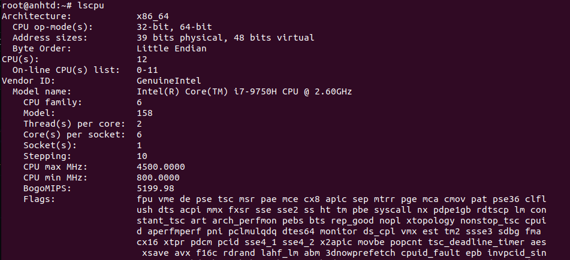
  

**Check RAM - `free`/`vmstat` command**
  
  
**The `free` command**

- The `free` command in Linux/Unix is used to show memory (RAM/SWAP) information.


**Examples:**
1. Show memory usage in human-readable form
```
free -h 
```


2. Show memory usage in MB
```
free -m
```


#### `vmstat` command
- The `vmstat` command lets you monitor the performance of your system. It shows you information about your memory, disk, processes,
CPU scheduling, paging, and block IO. This command is also referred to as **virtual memory statistic report**.

**Examples:**
- If we run `vmstat -a`, it will show us the active and inactive memory of the system running.
```
vmstat -a
```
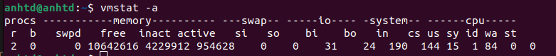


```
vmstat
```

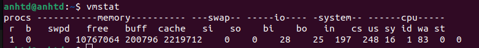

- As you can see it is a pretty useful little command. The most important things that we see above are the `free`, which shows us the free space that is not being used, `si` shows us how much memory is swapped in every second in kB, and `so` shows how much memory is swapped out each second in kB as well.
  
  

#### The `ping` command

* The `ping` (Packet Internet Groper) command is used to check the network connectivity between host and server/host. This command takes as input the IP address or the URL and sends a data packet to the specified address with the message “PING” and get a response from the server/host this time is recorded which is called latency.

* The basic ping syntax includes ping followed by a hostname, a name of a website, or the exact IP address.
```
ping [option] [hostname] or [IP address]
```

**Examples:**

1. To check whether a remote host is up, in this case, google.com
```
ping google.com
```

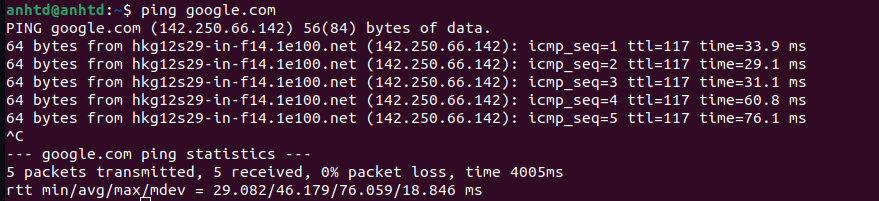
  
2. Controlling the number of pings: 
- Earlier we did not define the number of packets to send to the server/host by using -c option we can do so. 

```
ping -c 5 google.com
```

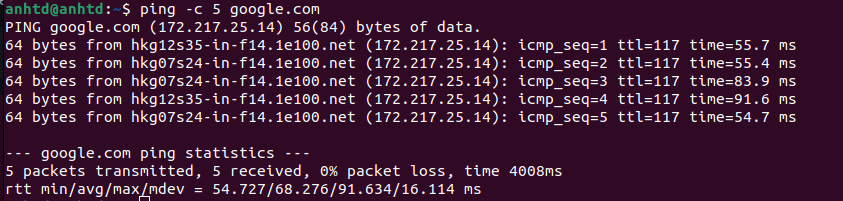


1. Controlling the number of pings: 
- Earlier a default sized packets were sent to a host but we can send light and heavy packet by using -s option. 

```
ping -s 30 -c 4 google.com
```

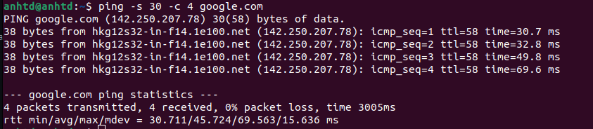  


4. Changing the time interval: 
- By default ping wait for 1 sec to send next packet we can change this time by using -i option.  

```
ping -i 3 -c 4 google.com
```

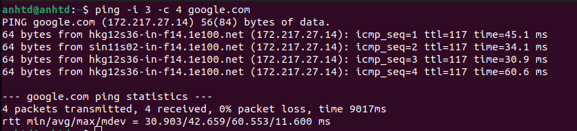

#### `ifconfig` command
* `ifconfig` is used to configure the kernel-resident network interfaces.  It is used at boot time to set up interfaces as necessary.  After that, it is usually only needed when debugging or when system tuning is needed.


* If no arguments are given, `ifconfig` displays the status of the currently active interfaces.  If a single interface argument is given, it displays the  status  of the  given interface only; if a single -a argument is given, it displays the status of all interfaces, even those that are down.  Otherwise, it configures an interface.

**Examples:**

1. To display the currently active interfaces:

```
ifconfig
```
  
2. To display details of the specific network interface (say `enp7s0`):
```
ifconfig enp7s0
```

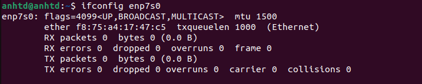

3. To activate the driver for a interface (say `eth0`):
```
ifconfig eth0 up
```

<div id='4'></div>
  
### 4. Process Monitor
  
#### `ps` command 
* The `ps` command is a traditional Linux command to lists running processes. The following command shows all processes running on your Linux based server or system:
```
  ps -aux
```
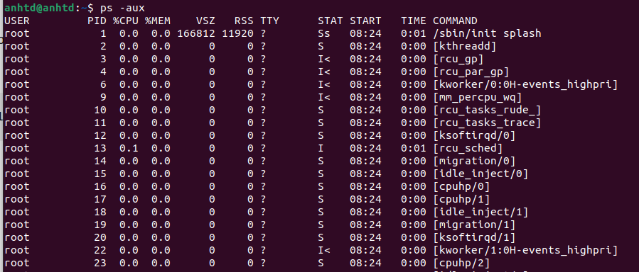
 
The process ID (PID) is essential to kill or control process on Linux. 
  
#### `pgrep` command
* `pgrep` is a command-line utility that allows you to find the process IDs of a running program based on given criteria. It can be a full or partial process name, a user running the process, or other attributes.
 
**Syntax**
```
pgrep [OPTIONS] <PATTERN>
```
  
**Example:**
* When invoked without any option, `pgrep` displays the PIDs of all running programs that match with the given name. For example, to find the PID of the SSH server, you would run:

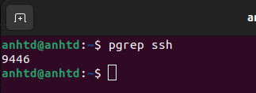

* The `-l` option tells `pgrep` to show the process name along with its ID:
  
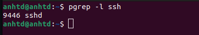

*  Another command to list process with an easy way for us to follow is`pstree` 
To list process with PIDs you use
``` 
pstree -p
```
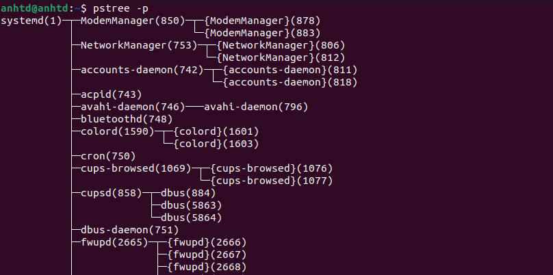
 
  
 #### `kill` command
`kill` command in Linux (located in /bin/kill), is a built-in command which is used to terminate processes manually. The `kill` command sends a signal to a process which terminates the process. If the user doesn’t specify any signal which is to be sent along with kill command then default _TERM_ signal is sent that terminates the process.
    
**Syntax**

```
kill [OPTIONS] [PID]...
```
  
**Examples:**
1. To display all the available signals you can use below command option:

```
kill -l
```
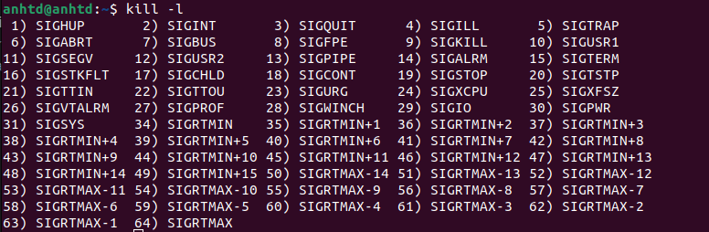
  

2. To show how to use a _PID_ with the _kill_ command.

```
kill pid
```

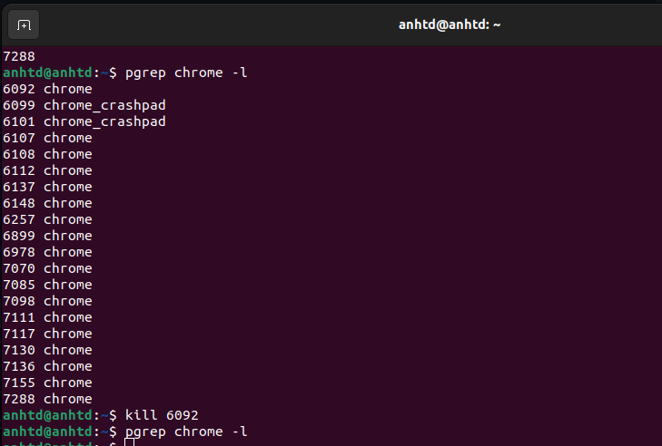
  
#### `htop` command
* `htop` command in Linux system is a command line utility that allows the user to interactively monitor the system’s vital resources or server’s processes in real time. `htop` is a newer program compared to `top` command, and it offers many improvements over `top` command. `htop` supports mouse operation, uses color in its output and gives visual indications about processor, memory and swap usage. `htop` also prints full command lines for processes and allows one to scroll both vertically and horizontally for processes and command lines respectively.
  
**Examples:**
  
  1. Display dynamic real-time information about running processes. An enhanced version of `top`.
  ```
    htop
  ```  
  
  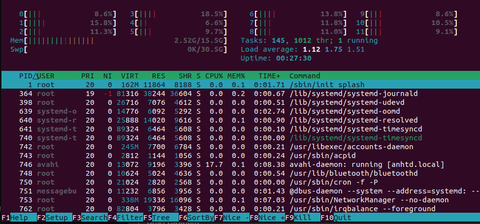
  
  2. Displaying processes owned by a specific user:

    ```
    htop --user {user_name}
    htop -u {user_name}
    ```
  
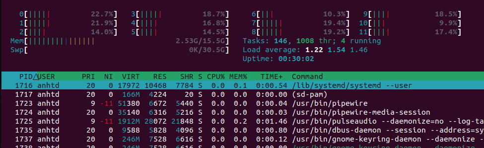  

***
  
<div id='5'></div>

### 5. List File and Directory 
 
#### `ls` command
  
- The `ls` command lets you see the files and directories inside a specific directory *(current working directory by default)*.
It normally lists the files and directories in ascending alphabetical order.

**Examples:**

1. To show the files inside your current working directory:

```
ls
```
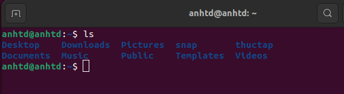

2. To show the files and directory inside a specific Directory:

```
ls {Directory_Path}
```
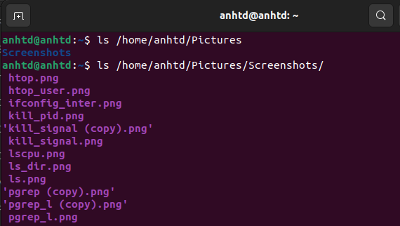
 
   
3. Type the ``ls -d */`` command to list only directories:

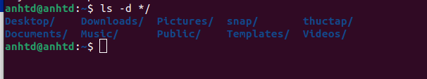

***

<div id='6'></div>

### 6. Action with Files/Directory

#### `find` command
The `find` command lets you **search for files in a directory hierarchy** 

-   Search a file with specific name.
-   Search a file with pattern
- 	Search for empty files and directories.

**Example**
1. Search a file with specific name:

```
find ./directory -name name_of_files
``` 
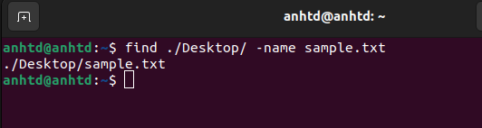

1. To find all directories whose name is test in / directory.

```
find / -type d -name test
```
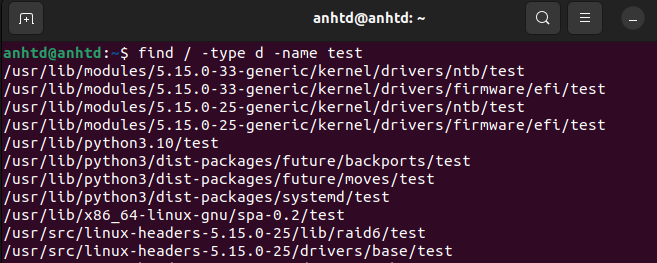

****

#### `cp` command
- `cp` stands for copy. This command is used to copy files or group of files or directory. It creates an exact image of a file on a disk with different file name. The cp command requires at least two filenames in its arguments.

**Examples**

1. To copy the content of the source file to the destination file.

```
cp sourceFile destFile
```

- If the destination file doesn't exist then the file is created and the content is copied to it. If it exists then the file is overwritten. 


2. To copy a file to another directory specify the absolute or the relative path to the destination directory.

```
cp sourceFile /folderName/destFile
```


3. To copy a directory, including all its files and subdirectories

```
cp -R folderName1 folderName2
```

#### Additional Flags and their Functionalities:

|**Short Flag**   |**Long Flag**   |**Description**   |
|:---|:---|:---|
|`-i`|<center>--interactive</center>|prompt before overwrite|
|`-b`|<center>-</center>|Creates the backup of the destination file in the same folder with the different name and in different format.|
|`-n`|`--no-clobber`|do not overwrite an existing file (overrides a previous -i option)|

****

#### `mv` command
The `mv` command lets you **move one or more files or directories** from one place to another in a file system. It also can be use to:
- rename a file or foldes
- move a group of file to a different directory.

**Syntax:**

```
mv [options] source (file or directory)  destination
```

**Example**

1. To rename a file called old_name.txt:

```
mv old_name.txt new_name.txt
```


2. To move a file name **_test.txt_** from the current directory to a directory called **_adir_** and rename it **_test1.txt_**:

```[linux]
mv test.txt adir/test1.txt
```

****

#### `rm` command


- `rm` which stands for "remove" is a command used to remove *(delete)* specific files. It can also be used to remove directories by using the appropriate flag.

**Example:**
1. Remove a specific file name:
```
rm filename.txt
```
2. To remove a file whose name starts with `-` such as `-foo`, use one of the following commands:
   - `rm -- -foo`
   - `rm ./-foo`

**Syntax**
```
rm [OPTION] [FILE|DIRECTORY]
```

***

<div id='7'></div>

### 7. Basic and advanced decentralization
#### `chmod` command
- The `chmod` command allows you to change the permissions on a file using either a symbolic or numeric mode or a reference file.

**Examples**
1. Change the permission of a file using symbolic mode:
```
chmod u=rwx,g=rx,o=r hello1.txt
```

The command above means :
- user can read, write, execute `myfile`
- group can read, execute `myfile`
- other can read `myfile`

2. Change the permission of a file using numeric mode

```
chmod 754 myfile user:group file.txt
```

The command above means :

- user can read, write, execute `myfile`
- group can read, execute `myfile`
- other can read `myfile`


3. Change the permission of a folder recursively

```
chmod -R 754 folder
```
***

#### `chmown` command
- The `chown` command makes it possible to change the ownership of a file or directory.  Users and groups are fundamental in Linux, with `chown` you can change the owner of a file or directory. It's also possible to change ownership on folders recursively

**Example**
1. Change the owner of the file

```
chown user file.txt
```
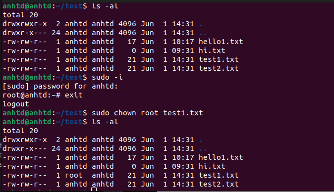


2. Change the group of a file

```
chown :group file.txt
```
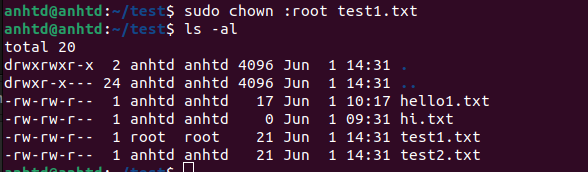

3. Change the user and group in one line

```
chown user:group file.txt
```
***

#### `chgrp` command
- chgrp command in Linux is used to change the group ownership of a file or directory. All files in Linux belong to an owner and a group. You can set the owner by using `chown` command, and the group by the `chgrp` command.
  
**Syntax**
```
chgrp [OPTION]... GROUP FILE...
```
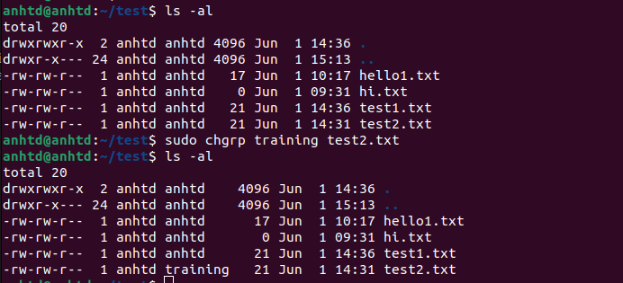

***

<div id='8'></div>

### 8. Editor
#### `vim` command
- The `vim` is a text editor for Unix that comes with Linux, BSD, and macOS. It is known to be fast and powerful, partly because it is a small program that can run in a terminal (although it has a graphical interface). 
- `vim` stands for "Vi Improved", and is an improved clone of the `vi` editor.


**Syntax:**

```
vim [FILE_PATH/FILE_NAME]
```

**Example:**
1. To open the file named "demo.txt" from your current directory:

```
vim test1.txt
```
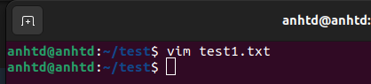

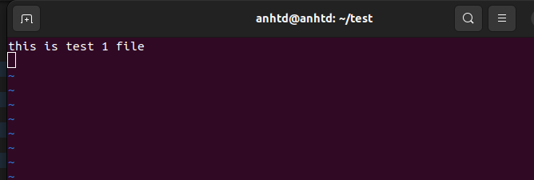

2. To open the file in a specific directory:

```
vim {File_Path/filename}
```


The command to save the file and exit vim editor: ```:wq```

The command to exit vim editor without saving the file: ```:q!``` 

****

#### `nano` command
- Nano text editor is pre-installed on macOS and most Linux distros. It's an alternative to `vi` and `vim`.

**Examples:**

1. Open an existing file, type `nano` followed by the path to the file:

```
nano /path/to/filename
```


2. Create a new file, type `nano` followed by the filename:

```
nano filename
```
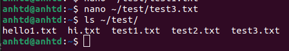


<div id='9'></div>

### 9. Mount/Unmount


- The `umount` command **unmounts** a mounted filesystem, informing the system to complete any pending read or write operations, and safely detaching it.

#### `mount` command

- The `mount` command mounts a storage device or `filesystem`, making it accessible and attaching it to an existing directory structure.

**Examples:**


<div id='10'></div>

### 10. Symbolic Links / Hard Links

#### Symbolic Links
- Symbolic Link in the computer industry is a term that refers to a file that references another file or directory in the form of a relative or absolute path. It is also often referred to as `Symlink` or `softlink`.

**Syntax:**
``` 
ln -s [target file] [Symbolic filename]
```
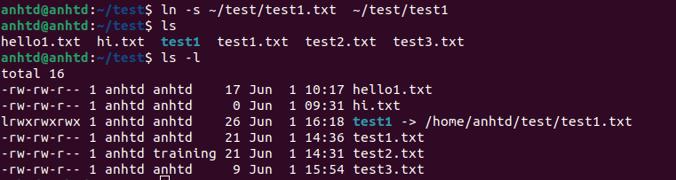

- To remove symbolic link, we use `unlink` or `rm`


****

#### Hard Links
- Hard links are low-level links that the system uses to create components of the file system itself, such as files and directories. A hard link will create a link in the same filesystem with 2 corresponding inode entries pointing to the same physical content (same inode number because they point to the same data).

**Syntax** 
```
ln [srcFile] [desFile]
```
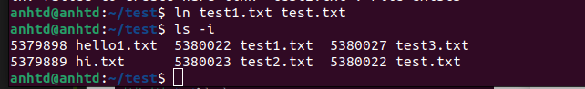

- You can see the inode number of file **test1.txt** and **test.txt** is the same (5380022). When we delete **test1.txt**, the content of **test.txt** file still there.

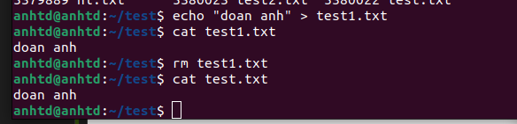

- The content in **test.txt** is still there because when deleting the **test1.txt** file, the system only deletes the link count in the file's inode by 1.
-  When using the `rm` command to delete a file, one hard link is reduced. When the number of hard links is reduced to 0, the contents of the file can no longer be accessed


<div id='11'></div>

### 11. Compress and Decompress

#### `Gzip`
- The `gzip` command in Linux/Unix is used to compress/decompress data.

**Compress a file**
- Reduce the size of the file by applying compression
```
gzip file_name
```
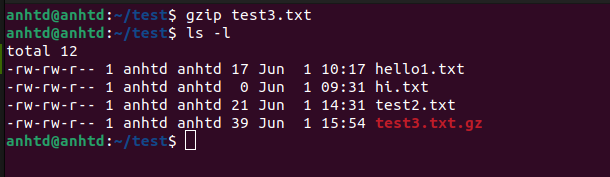


  
**Command:**
- Compress multiple files into multiple archives
```
gzip file_name_01 file_name_02 file_name_03
```
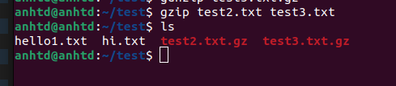


**Command:**
- Output more information about the action of the command
```
gzip -v file_name
```
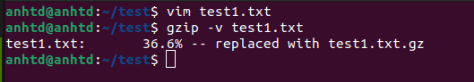


#### `GUnzip`
- The `gunzip` command is an antonym command of [`gzip` command. In other words, it decompresses files deflated by the `gzip` command.
- `gunzip` takes a list of files on its command line and replaces each file whose name ends with _.gz_, _-gz_, _.z_, _-z_, or *\_z* (ignoring case) and which begins with the correct magic number with an uncompressed file without the original extension. `gunzip` also recognizes the special extensions *.tgz* and *.taz* as shorthands for *.tar.gz* and  *.tar.Z*  respectively.

**Example**

1. Uncompress a file

```
gunzip filename.gz
```

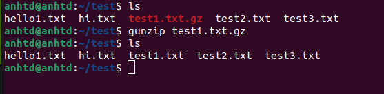

2. Recursively uncompress content inside a directory, that match extension (suffix) compressed formats accepted by `gunzip`:

```
gunzip -r directory_name/
```

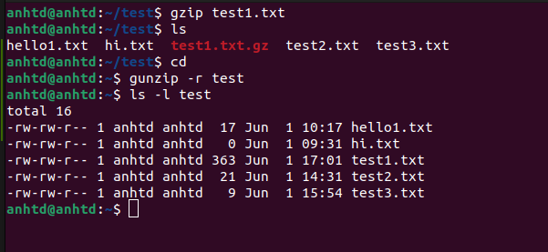

|**Short Flag**|**Long Flag**|**Description**|
|:---|:---|:---|
|-c|--stdout|write on standard output, keep original files unchanged|
|-h|--help|give help information|
|-k|--keep|keep (don't delete) input files|
|-l|--list|list compressed file contents|
|-q|--quiet|suppress all warnings|
|-r|--recursive|operate recursively on directories|
|-S|--suffix=SUF|use suffix SUF on compressed files|
||--synchronous|synchronous output (safer if system crashes, but slower)|
|-t|--test|test compressed file integrity|
|-v|--verbose|verbose mode|
|-V|--version|display version number|


#### `tar` command
- The `tar` command  stands for tape archive, is used to create Archive and extract the Archive files. This command  provides archiving functionality in Linux. We can use tar command to create compressed or uncompressed Archive files and also maintain and modify them. 

**Examples:**
1. To create a tar file in another directory
```
tar -cvf file_name dir_name
```
With:
- c – Create a new .tar file
- v – Display the compression process on the screen
- f – Filename
#### untar Archive file 

**Syntax**
```
tar -xvf file_name.tar
```

 
If you want to untar in a different directory then use option as -C (specified directory).
```
tar -xvf file_name.tar -C path_to_directory
```

<div id='12'></div>

### 12. Bandwidth monitoring

#### `vnstat` command
- `vnstat` is a command-line tool in Linux that is generally used by system administrators in order to monitor network parameters such as bandwidth consumption or maybe some traffic flowing in or out. It monitors the traffic on the network interfaces of the system. 

**Install vnstat in Ubuntu or Debian Linux**
```
sudo apt-get install vnstat
```

**Examples:**
1. To get basic stats of all network interfaces 
```
vnstat
```

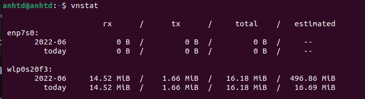

This command will print all the basic stats of the network interfaces connected to the system. 

2. To monitor a specific interface 
``` 
vnstat -i wlp0s20f3 
```
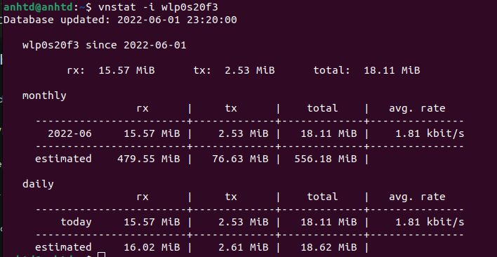

This will monitor and display the stats of the specified interface that is wlp0s20f3 

3. To get the daily stats of an interface 
```
vnstat -d -i wlp0s20f3
```
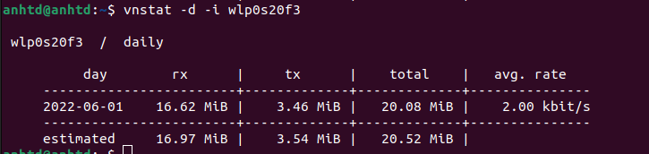

****

#### `nload` command
- `nload` is a tool on Linux to monitor network traffic and bandwidth usage in real time. It helps you to monitor IN(incoming) and OUT(outgoing) traffic using graphs and provides a lot of additional information such as total amount of data transferred and average/minimum/minimum network usage multi.

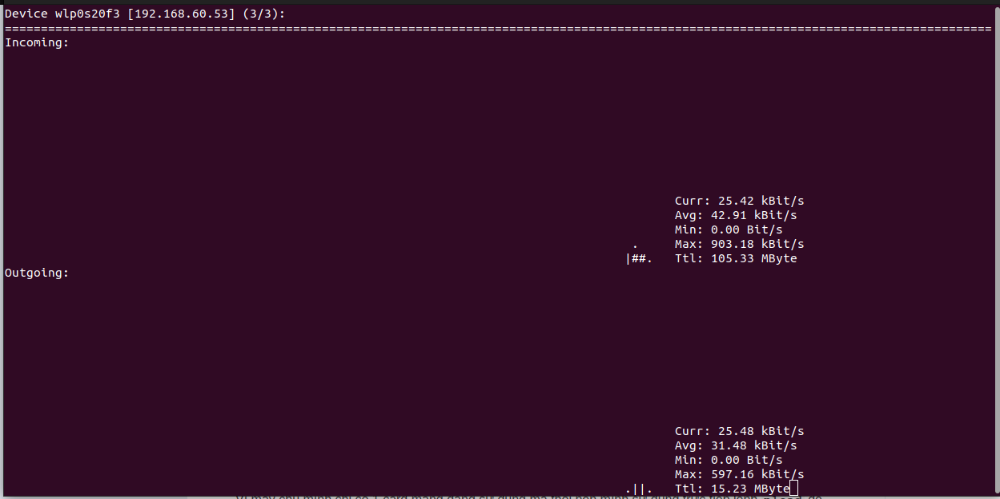


**Examples**
1. Use ``nload -m`` to see all network card on your computer

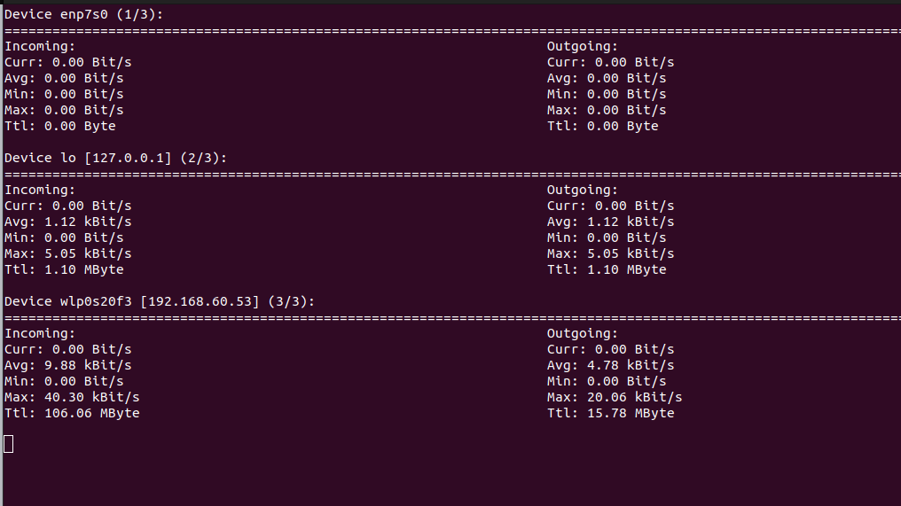

2. Use ``-a`` and interval to set the length in seconds of the average (default is 300), for example you want to calculate the average bandwidth in 400 seconds then use the following command :
``` 
nload -a 400
```

3. You can specify the network card that you need to monitor with the following command.
```
nload devices device_name
```
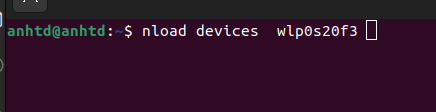


<dev id='13'></dev>

### 13. nmap, telnet, ping, ssh, copy file/directory from local to public host

#### `nmap` command 
Nmap is Linux command-line tool for network exploration and security auditing. This tool is generally used by hackers and cybersecurity enthusiasts and even by network and system administrators. It is used for the following purposes: 

- Real time information of a network
- Detailed information of all the IPs activated on your network
- Number of ports open in a network
- Provide the list of live hosts
- Port, OS and Host scanning
  
**Install nmap**
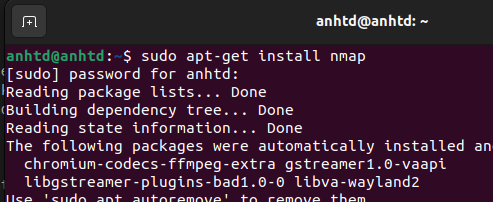

**Examples**
1. Scan with host name:
```
nmap host_name
```
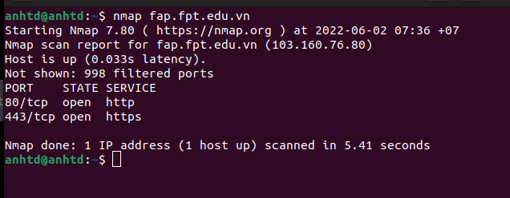

2. Scan with ip:
``` 
nmap ip_address
```
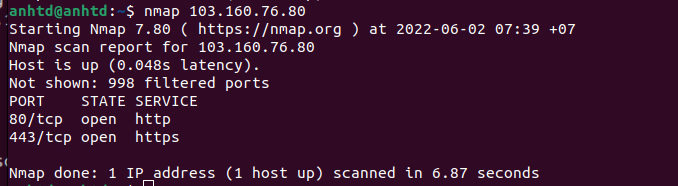

The nmap command allows scanning a system in various ways. In this we are performing a scan using the hostname as “fap.fpt.edu.vn” and IP address “103.160.76.80”, to find all open ports, services, and MAC addresses on the system.

3. Scan to detect firewall settings:
```
nmap -sA ip_address
```
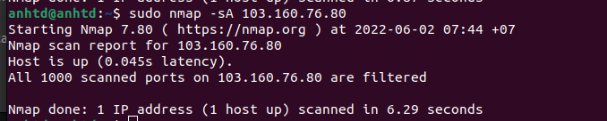

Detecting firewall settings can be useful during penetration testing and vulnerability scans. To detect it we use “-sA” option. This will provide you with information about firewall being active on the host. It uses an ACK scan to receive the information.

4. To identify Hostnames  
``` 
sudo nmap -sL ip_address
```
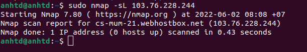

5. Here It Will Display The Operating System Where The Domain or Ip Address is Running But Will Not Display Exact Operating System Available On Computer. It Will Only Display The Chance of Operating System Available in The Computer. This Will Just Guess the Running Operating System (OS) in the Host.

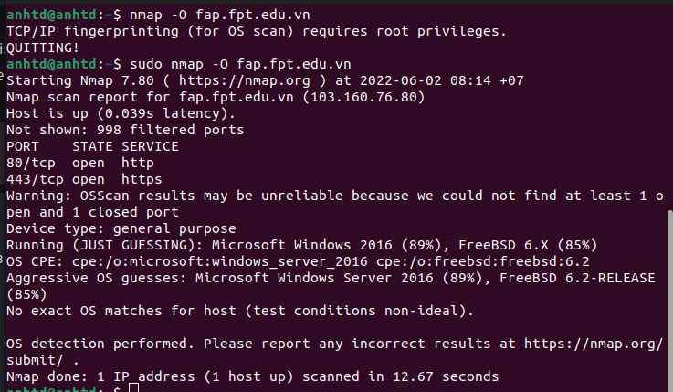


#### `telnet` command


