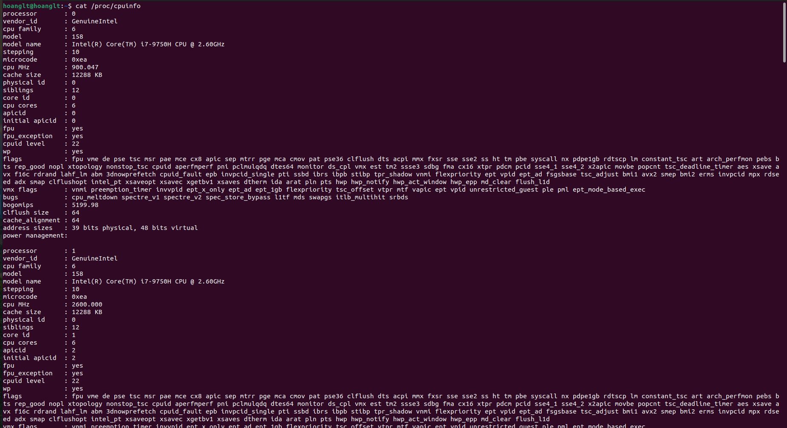
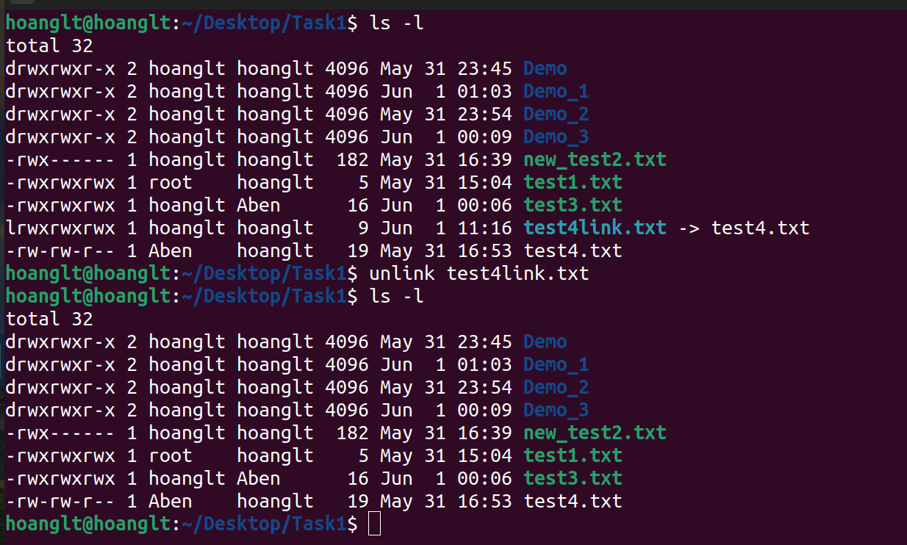
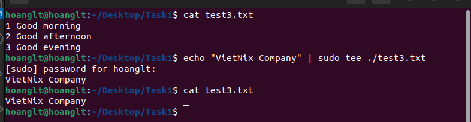

# System Management Linux Basic

1. <a href='#1'> Check Diskpace
2. <a href='#2'> Check Partitions
3. <a href='#3'> Check cpu, ram, network
4. <a href='#4'> Process Monitor
5. <a href='#5'> List files/ diretories
6. <a href='#6'> Find, copy, move, ... file/directory
7. <a href='#7'> System Decentralization
8. <a href='#8'> Editors program
9. <a href='#9'> Mount/ Unmount
10. <a href='#10'> Symbolic Links
11. <a href='#11'> Hard Links
12. <a href='#12'> Zip and Unzip
13. <a href='#13'> Bandwith monitoring 
14. <a href='#14'> Nmap, telnet, ping ,ssh copy file/ directory from local to pulic host 
15. <a href='#15'> Generate ssh-key
16. <a href='#16'> Read file content without program editor
17. <a href='#17'> Add content at the end of file
18. <a href='#18'> find, grep, awk, sed, tr, head, tail, less, more, sort, uniq, cut, join, diff, xargs, traceroute, netstat, kill, pkill, wc, wget, git, rsyn, ping, tee, ln, mkdir
19. <a href='#19'> Standard Input, Standard Output, and Standard Error
20. <a href='#20'> Redirecting Standard Input, Output, Error
21. <a href='#21'> /dev/null
    

## 1. Check Diskpace
### a.df
* Shows the amount of disk space used and available on Linux file systems.
* Syntax:
`df [OPTION] ... [FILE]`
* Example: 
> df -h : print the size that human can read

* If want to see the collume entry on the scree You can use some `--output` belows:
  *  `Source`: Source of Mount device points
  *  `Size`: Total Block
  *  `Used`: The total number of blocks used
  *  `Avail`: Total blocked blocks available
  *  `PCENT`: Percentage of used drive space
  *  `Target`: Mount point for device

### b.du
* check specific file size
* Syntax: 
`du [OPTION] ... [FILE]`
* Example:
> df -sh 
* Options:
  *  -s: print the result follow sumary
  *  -h: print the size that human can read
 

## 2. Check Partitions
### a.fdisk
* fdisk is a dialog-driven program for creation and manipulation of partition tables. It understands GPT, MBR, Sun, SGI and BSD partition tables.
* Syntax:
`fdisk [OPTION] device`
> fdisk -l

### b.lsblk
* lsblk: lists information about all available or the specified block devices.
* Syntax: 
`lsblk [OPTION] [device...]`

## 3. Check cpu, ram, network
### a.CPU
* lscpu display information about the CPU architecture
* Syntax:
`lscpu`

* Others command: 
`cat /proc/cpuinfo`

### b.RAM
* **free** command to check your RAM on Linux
* Syntax:
`free -h`

* Others command
`cat /proc/meminfo`

### c.NETWORK
* Netstat prints information about the Linux networking subsystem
* Syntax:
`netstat`

`netstat -lnp`
* **-lnp** Listen all active listening ports connection

## 4. Process Monitor
* **top** The  top program provides a dynamic real-time view of a running system
* Syntax:

`top`

`uptime`

* **ps** displays information about a selection of the active processes.
* Syntax:
`ps [OPTION]`
* Some Options can use
  *  -aux: Print all process on the server
  *  -ef: Show all the processes in the system in detail.
  *  -u: to display information of processes for the specified username. 

## 5. List files/ directories
* The ls command also accepts some flags which are additional information that changes how files or directories are listed in your terminal.
* Syntax:
`ls`
  *  -la: to list files or directories in a table format with extra information including hidden files or directories
 
 
 
 * **Tree** is a recursive directory listing program that produces a depth indented listing of files
 * Syntax:
 `tree`
 
 

 

 
## 6. Find, copy, move,... file/directory
 * The **find** search for files in a directory hierarchy
 * Syntax: 
  
  `find . -name [filename]`
       
    `. is indicates the current directory.`
         
    `-name if you want the search for a word or phrase to be case insensitive.`

`locate -b '[filename]'`

* The **which** returns the pathnames of the files (or links) which would be executed in the current environment, had its arguments been given as commands in a strictly POSIX-conformant shell.
* Syntax:
`which -a telegram`

* The whereis locates the binary, source and manual files for the specified command names.
* Syntax:
`whereis [options] [-BMS directory... -f] name...`

* **cp** is a command to copy files and directories.
* **mv** is used to move one or more files or directories from one place to another in a file system.
* Sytax:
`cp [OPTIONS] SOURCE... DESTINATION
 mv [OPTIONS] SOURCE... DESTINATION`
 
 
 
 

 

 
## 7. System Decentralization
 * **chmod** modifies the permissions of the file specified by file name to the permissions specified by permissions.
 * Syntax:
 `chmod options permissions <file_name>`
 * Options:
   *  u: user
   *  g: group
   *  o: owner
 * Permissions:
   *  r: read (4)
   *  w: write (2)
   *  x: excute (1)
 * Example:
 `chmod a+wx  `
 
 
 
 * **chown** used to change the owner.
 * **chgrp** used to change the group.
 * Syntax:
  
    `chown OWNER FILE`
 
    `chgrp GROUP FILE`
  
  
  

  

  
## 8. Editors program
  * Vim: **Vim** is a text editor that is upwards compatible to **Vi**
  * Vi: a programmers text editor
  * Syntax
  `vi [file]`
  * Some options to execute on Vi
    *  Press `i` - change *Command mode* to *Text mode*
    *  `:q!` - Quit and do not save
    *  `:wq` - Quit and save
  * Command mode
    *  `:set nu` - show the line number of the file 
    *  `:n` - Move the mouse pointer to the specified line
    *  `/text` - find the string text 
  
  

  * Nano: nano is a small and friendly editor
  * Syntax: 
  `nano [OPTION] [FILE]`

  

## 9. Mount/ Unmount
  ### a. Mount
  * mount command to attach (mount) file systems and removable devices such as USB flash drives at a particular mount point in the directory tree.
  * Syntax:
  `mount [OPTION...] DIRECTORY`
  `mount [OPTION...] DEVICE_NAME`
   
   
   

   

## 10. Symbolic Links
  * Symbolic links can hold arbitrary text; if later  resolved,  a relative link is interpreted in relation to its parent directory.
  * Syntax: 
  ` ln -s [target file] [Symbolic filename]`
  * To remove the symbolic links was created have two command: `unlink` or `rm`
  * Syntax:
  
  `unlink [symlink to remove]`
  
  `rm [symlink name]`
  
  
  

  

  
## 11. Hard Links
  * Hard link always points to a file with data in memory
  * Syntax
  `ln [target file] [Symbolic filename]`
  * Example
  
  

  

  
## 12. Zip and UnZip
  * **Tar** combines copression and decompression together, but uses different parameters
  * Syntax:
  ` tar [OPTION] [FILE]`
  * Options:
    * `-cvf` : gom các file
    * `-xvf` : tách các file
    * `-zcvf`: gom và nén các file
    * `-zxvf`: giải nén và bung
  
  
  

  * **Unzip**  is used to compress and decompress package in .zip format
  * Syntax: 
  `unzip[parameter][Unzip file name.zip]

  
  

  

## 13. Bandwidth monitoring
  * **vnstat** is a console-based network traffic monitoring tool design for Linux and BSD. It will keep a log of the network traffic for selected network interfaces.
  * `sudo apt install vnstat`
  * Syntax: 
  `vnstat[OPTION]`
  * Some options:
      * -h: check hourly
      * -d: check daily
      * -t: check time
  
  

  * **bmon** is a monitoring and debugging tool to capture networking related statistics and prepare them visually in a human friendly way
  * Syntax:

    `sudo apt install bmon`

    `bmon`
  
   
  

   
## 14.Nmap, telnet, ping, ssh copy file/directory from local to pulic host
  ### a.Nmap
  * **Nmap** Network exploration tool and security / port scanner
  * Syntax
   `nmap [Scan Type...] [Options] {target specification}`
   * Some options
     *  -sU:UDP Scan
     *  -sS:TCP SYN/Connect()/ACK/Window/Maimon scans
     *  -sn:Ping Scan - disable port scan
   * Examples:
   
   
   
   ### b.Telnet
   * telnet — The telnet command is used for interactive communication with another host using
     the TELNET protocol
   * Syntax: 
   ` telnet [OPTION] [HOST] [POST]
   * Example:
   
   
   
   ### c. Ping
   * **Ping** uses the ICMP protocol's mandatory *ECHO_REQUEST* datagram to elicit an *ICMP ECHO_RESPONSE* from a host or gateway
   * Syntax:
   ` ping [OPTION] [HOST]`
   * OPTIONS 
     * -4: Use IPv4 only
     * -6: Use IPv6 only
     * -t: ping only. Set the IP Time to Live.
   * Examples: 
   
   
   ### d.ssh
   * **ssh** (SSH client) is a program for logging into a remote machine and for executing commands on a remote machine
   * Syntax:
   `ssh [OPTION] [DESTINATION]
   * Example:
   
   
   
   ### e. SCP
   * SCP copies files between hosts on a network. It uses ssh(1) for data transfer, and uses the same authentication and provides the same security as ssh(1). scp will ask for passwords or passphrases if they are needed for authentication.
   * Syntax:
   `scp [SOURCE] user@ip_target:DESTINATION`

   

## 15. Generate ssh-key
   * ssh-keygen is a tool for creating new authentication key pairs for SSH. Such key pairs are used for automating logins, single sign-on, and for authenticating hosts.
   * Syntax:
   `ssh-keygen`
   * Create ssh-key on client
   `ssh-keygen -t -rsa`
   * Send ssh-key from client to server
   `ssh-copy-id -i [file key public] user@ip-address`
   * Connect with ssh-keygen

  
  

  

## 16. Read file content without program editor
   * **cat** - concatenate files and print on the standard output.
   * **head** - print  the  first  10 lines of each FILE to standard output.
   * **tail** print  the  last  10  lines of each FILE to standard output.
   * Syntax:
   ` cat [OPTION] [FILE]`
   ` head [OPTION] [FILE] `
   ` tail [OPTION] [FILE] `
   * Example:
   
   
   
   

  

## 17. Add content at the end of file
   * Syntax
   ` echo "Strings" >> [FILE]
   * Example 
   
   
   

## 18 find, grep, awk, sed, tr, head, tail, less, more, sort, uniq, cut, join, diff, xargs, traceroute, netstat, kill, pkill, wc, wget, git, rsyn, ping, tee, ln, mkdir
   * find : search for files in a directory hierarchy
   * Examples: 
   
   

   * grep - searches for PATTERNS in each FILE
   * Syntax:
   `grep [OPTION...] PATTERNS [FILE...]`

   

   * awk - pattern scanning and text processing language
   * Syntax: awk 
   
   

   * sed - stream editor for filtering and transforming text
   * Syntax:  
   `sed [OPTION]... {script-only-if-no-other-script} [input-file]...`

   

   * tr - translate or delete character
   * Syntax: 
   `tr [OPTION]... SET1 [SET2]`
   
   

   * sort - lines of text files
   * Syntax:
   `sort [OPTION]... [FILE]...`
   * Example
   

   * uniq - report or omit repeated lines 
   * Syntax: 
   ` uniq [OPTION]... [INPUT [OUTPUT]] `

   

   * cut - remove sections from each line of files
   * Syntax
   ` cut OPTION... [FILE]...`

   

   * join - join lines of two files on a common field
   * Syntax: 
   ` join [OPTION]... FILE1 FILE2 `

   

   * diff - compare files line by line
   * Syntax 
   ` diff [OPTION]... FILES `

   

   * xargs - build and execute command lines from standard input
   * Syntax:
   ` xargs [options] [command [initial-arguments]] `

   

   * traceroute - print the route packets trace to network host
   * Syntax:
   `traceroute  options]  host_Address [pathlength]`
   * Options: 
    *  -4: Use ip version 4 i.e. use IPv4
    *  -6: Use ip version 6 i.e. use IPv6
    *  -F: Do not fragment packet.
    *  -n: Do not resolve IP addresses to their domain names.
    *  -p: Set the destination port to use. Default is 33434.
   
   

   * netstat -  Print network connections, routing tables, interface statistics, masquer ade connections, and multicast memberships
   * Syntax:
   ` netstat [OPTION] [DESTINATION]`
   
   

   * kill - send a signal to a process
   * Syntax:
   `kill [options] <pid> [...]`
   * Options:
   -l: display all the available signals
   -s : To show how to send signal to processes.
   -L :This command is used to list available signals in a table format.

  

  * pkill - pgrep looks through the currently running processes and lists the process IDs  which match  the selection criteria to stdout
  * Syntax:
    `pkill [options] pattern`

  

  * wc - print newline, word, and byte counts for each file
    * Syntax
    `wc [OPTION]... [FILE]...`
    * Options:
    -l: prints the number of lines present in a file.
    -w: prints the number of words present in a file.

  

  * wget - The non-interactive network downloader.It supports HTTP, HTTPS, and FTP protocols, as well as retrieval through HTTP proxies.
    * Syntax: 
    ` wget [option]... [URL]...`
    * Options
    -o: is used to direct all the messages generated by the system.
    -i: is used to read URLs from file. 
    -c: is used to resume a partially downloaded file.
    
  

  * git Git is a fast, scalable, distributed revision control system with an unusually rich command set that provides both high-level operations and full access to internals.
    * Syntax
    `git <command> [<args>]`
    * Commands
        * add: Add file contents to the index
        * clone: Clone a repository into a new directory
        * push: Update remote refs along with associated objects
        * commit: Record changes to the repository
    
  
  * rsync - Rsync is a fast and extraordinarily versatile file copying  tool
    * Syntax:
      ` rsync [OPTION...] SRC... [DEST`
    
  

  * tee - read from standard input and write to standard output and files
    * Syntax
    `tee [OPTION]... [FILE]...`

  

  * mkdir - Create the DIRECTORY(ies), if they do not already exist.
    * Syntax:
    `mkdir [OPTION]... DIRECTORY...`

  

  

## 19. Standard Input, Standard Output, and Standard Error
  * When a command begins running, it usually expects that three files are already open: standard input, standard output, and standard error 
  * When you enter a command, if no file name is given, your keyboard is the standard input, sometimes denoted as stdin. When a command finishes, the results are displayed on your screen.
  * Your screen is the standard output, sometimes denoted as stdout. By default, commands take input from the standard input and send the results to standard output.
  * Standard error, sometimes denoted as stderr, is where error messages go. By default, this is your screen.
  * 2>&1 
  
  

## 20. Redirecting Standard Input, Output, Error
  * When the notation > filename is added to the end of a command, the output of the command is written to the specified file name. The > symbol is known as the output redirection operator.
  * When the notation < filename is added to the end of a command, the input of the command is read from the specified file name. The < symbol is known as the input redirection operator.
  * In addition to the standard input and standard output, commands often produce other types of output, such as error or status messages known as diagnostic output. Like standard output, standard error output is written to the screen unless it is redirected.
  
  

## 21. /dev/null
  * The /dev/null file is a special file. This file has a unique property; it is always empty. Any data you send to /dev/null is discarded. This is a useful feature when you run a program or command that generates output you want to ignore.
  

# ~THE END~
    

    

     

     
   
   
    
 
  
  
  
  
  
  
   

  
  

