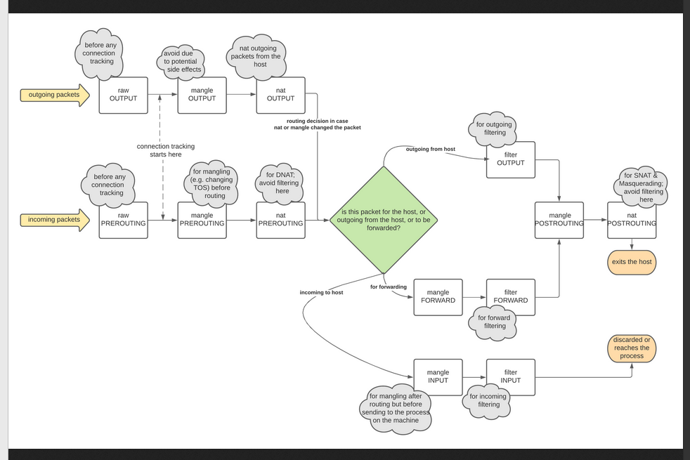
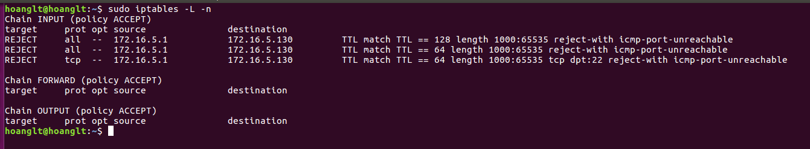
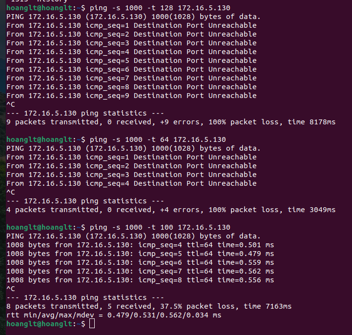
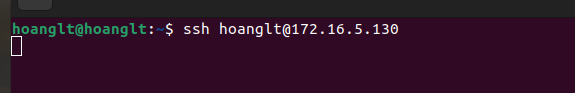
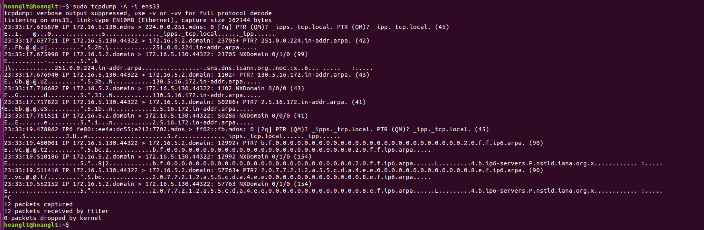
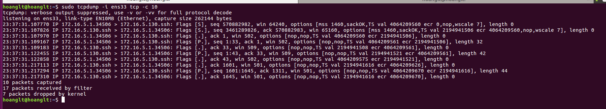
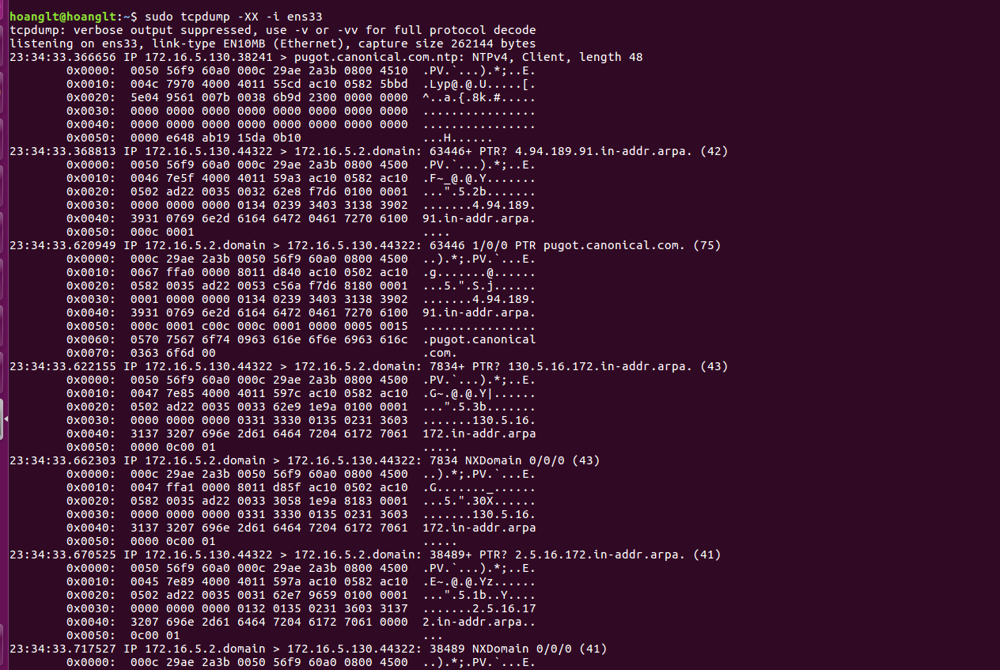
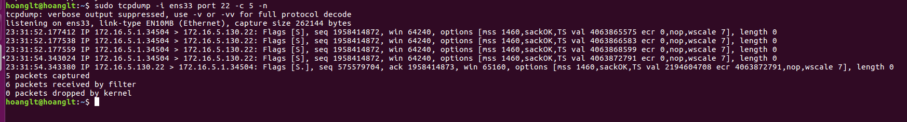
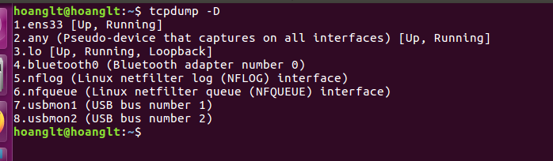

1. <a href='#1'> iptables packet flow diagram
2. <a href='#2'> Modul TRACE
3. <a href='#3'> iptables rules
4. <a href='#4'> tcpdump

## 1. iptables packet flow diagram
### a. Diagram

### b. Rules table
* NAT tale:The nat table is used mainly for Network Address Translation. "NAT"ed packets get their IP addresses altered, according to our rules.
* Type of chain:
    * OUTPUT Chain: is used for altering locally generated packets (i.e., on the firewall) before they get to the routing decision
    * PREROUTING Chain: is used to alter packets as soon as they get in to the firewall
    * POSTROUTING Chain: which is used to alter packets just as they are about to leave the firewall.
* Type of packet: 
    * SNAT(Source Network Address Translation) / MASQUERADE: SNAT is typically used when an internal/private server needs to initiate a connection to an external/public server. The device performing the NAT changes the source server's private IP address to a Public IP.
    * DNAT(Destination Network Address Translation) / REDIRECT: DNAT is used to hide private addresses. At the same time, the NAT device converts the public destination IP accessible to internet users into the private IP address of the web server. DNAT can also change the destination port in TCP/UDP. Its typical application is to redirect packets destined for a public address/port, to a private IP address/port within the network.
* Examples:
    iptables -t nat -A POSTROUTING -o eth0 -j SNAT --to <ipaddress>
    iptables -t nat -A POSTROUTING -o ppp0 -j MASQUERADE

* Mangle Table: This table is used mainly for mangling packets. Among other things, we can change the contents of different packets and that of their headers.
* Type of Chain:
    * INPUT Chain: is used to alter packets after they have been routed to the local computer itself, but before the user space application actually sees the data
    * OUTPUT Chain: is used for altering locally generated packets after they enter the routing decision
    * FORWARD Chain: is used to mangle packets after they have hit the first routing decision, but before they actually hit the last routing decision.
    * PREROUTING Chain: is used for altering packets just as they enter the firewall and before they hit the routing decision
    * POSTROUTING Chain: is used to mangle packets just after all routing decisions have been made
* Type of actions/target
    * TOS(Type of service)
    * TTL(Time to live)

* Filter Table: The filter table should be used exclusively for filtering packets.
    * INPUT Chain: is used on all packets that are destined for our local host (the firewall)
    * OUTPUT Chain: is finally used for all locally generated packets. 
    * FORWARD Chain: is used on all non-locally generated packets that are not destined for our local host (the firewall, in other words).

* Raw Table: The raw table and its chains are used before any other tables in netfilter.
    * PREROUTING chain can be used for all incoming packets to this machine, or that are forwarded
    * OUTPUT chain can be used to alter the locally generated packets before they hit any of the other netfilter subsystems. 

* The traffic of packet 
    * Destination local host: 
        * Step 1: raw(PREROUTING): This chain is used to handle packets before the connection tracking takes place.
        * Step 2: mangle(PREROUTING): This chain is normally used for mangling packets, i.e., changing TOS and so on.
        * Step 3: nat(PREROUTING): This chain is used for DNAT mainly. Avoid filtering in this chain since it will be bypassed in certain cases.
        * Step 4: mangle(INPUT): The mangle INPUT chain is hit. We use this chain to mangle packets, after they have been routed
        * Step 5: filter(INPUT): This is where we do filtering for all incoming traffic destined for our local host.
    * Forwarded packets
        * Step 1: raw(PREROUTING): You can set a connection to not be handled by the connection tracking system.
        * Step 2: mangle(PREROUTING): This chain is normally used for mangling packets, i.e., changing TOS and so on.
        * Step 3: nat(PREROUTING): This chain is used for DNAT mainly. SNAT is done further on.
        * Step 4: mangle(FORWARD): The packet is then sent on to the FORWARD chain of the mangle table. This can be used for very specific needs, where we want to mangle the packets after the initial routing decision,
        * Step 5: filter(FORWARD): The packet gets routed onto the FORWARD chain. Only forwarded packets go through here, and here we do all the filtering.
        * Step 6: mangle(POSTROUTING): This chain is used for specific types of packet mangling that we wish to take place after all kinds of routing decisions have been done
        * Step 7: nat(POSTROUTING): This chain should first and foremost be used for SNAT
    * Source Local Host
        * Step 1: raw(OUTPUT):: This is where you do work before the connection tracking has taken place for locally generated packets 
        * Step 2: mangle(OUTPUT) This is where we mangle packets, it is suggested that you do not filter in this chain since it can have side effects.
        * Step 3: nat(OUTPUT): This chain can be used to NAT outgoing packets from the firewall itself.
        * Step 4: filter(OUTPUT): This is where we filter packets going out from the local host.
        * Step 5: mangle(POSTROUTING)) is mainly used when we want to do mangling on packets before they leave our host
        * step 6: nat(POSTROUTING): This is where we do SNAT as described earlier.
        

## 2. Modul TRACE
* 
    

## 3. iptables rules
* When a packet matches a rules, it is given a Target
    * ACCEPT: will allow  the packet to pass through
    * DROP: will not let the packet to pass through
    * REJECT: the iptables firewall rejects a packet and sends an error to the connecting device.
    * RETURN: stop the packet from the trarvesing throung a chain and tell it to go back to the previous chain 
* The defult tables 
    * INPUT: controls incoming packet to the server 
    * OUTPUT: filter packet that are going out from the server
    * FORWARD: filer in comming packet that will be forwarded something else.
* Some syntax options:
    * **-A**: Addd a new rules to a chain at a the end tables
    * **-I**: Add a new rules at a chain a given position 
    * **-F**: Remove all the rules in the tables
    * **-D**: remove the specified relus from a chain 
    * **-i**: the network interface whose traffic you want to filter
    * **-s**: the address from which traffic comes from
    * **-d**: the address from which traffic out 
    * **-p**: the network protocol where your filtering process takes place. It can be either tcp, udp, udplite, icmp, sctp, icmpv6, and so on. 
    * **-dport**: the destination port number of a protocol, such as 22 (SSH), 443 (https)
    * **-j <target>**: the target name (ACCEPT, DROP, REJECT, RETURN). You need to insert this every time you make a new rule.
* Examples:
    * Accept/Block IP connect to IP dest A.B.C.D port YYY
        * #iptbales -A INPUT -p tcp -d <A.B.C.D> --dport<YYY> -j ACCEPT/DROP
    * Accept/Block all new ip connect to IP dest A.B.C.D port YYY
        * iptables -A INPUT -p tcp -d <A.B.C.D> --dport <YYY> -j ACCEPT
        * iptables -A INPUT -p tcp -d <A.B.C.D> -m state --state ESTABLISHED,RELATED --dport <YYY> -j DROP
    * Accept/Block ip Y.J.K.F connect to IP dest A.B.C.D port YYY with TTL 128,64 and Length 1000
        * iptables -A INPUT -p tcp -s <Y.J.K.F> --m ttl--ttl-eq 128 -m length --length 1000:65535 -d <A.B.C.D> --dport <YYY> -j ACCEPT/DROP

## 4. TCPDUMP
* Tcpdump: prints out a description of the contents of packets on a network interface that match the Boolean expression; the description is preceded by a time stamp, printed, by default, as hours, minutes, seconds, and fractions of a second since midnight.
* Options
    * **-D**: display a list of interface
    * **-s**: sets length of each packet to be collected. 
    * **-i**: Specifies the number of packets to capture
    * **-n**: to skip DNS name lookups
    * **-c**: Specifies the packets to capture
    * **-w /path**: Define a file that tcpdump should write to
    * **-r /path**: Read a packet file
    * **-xx**: Capture the packet an ASCII and HEX

* Examples: 
    * We can use pipe such as **uniq, cut, awk** to filetring the traffic . To print the destination and port
    * tcpdump -i <interface> tcp port <port number>
    * tcpdump -i <interface> tcp dst port <port number> and src host <ipadress> 
    * tcpdump -n -i <interface> | awk -F" " '{print $3}' | sort | uniq -c | head
    * tcpdump -n icmp -i <interface>
    * tcpdump **'tcp[13] & 2 != 0'** : *Show all SYN packets*

