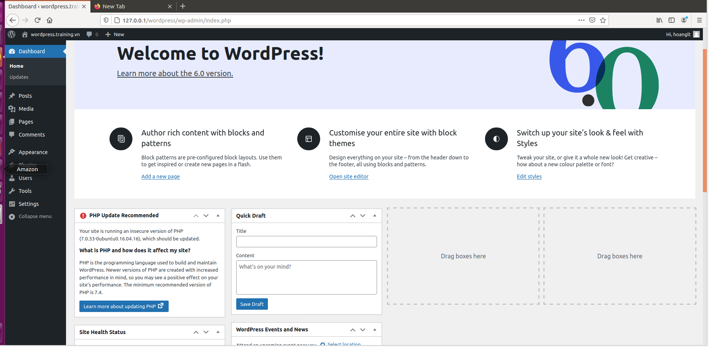

1. <a href='#1'> LAMP Stack
2. <a href='#2'> LEMP Stack 

# 1.LAMP Stack

* Disable firewall 

## a. Install Apache2
* Install apache2
  * sudo apt-get install apache2 -y

* Enable and start service apache2
  * sudo systemctl enable apache2
  * sudo systemctl start apache2
* Check status of service apache2
  * sudo systemctl status apache2

* Check apache2 on web browser 

## b. Install MariaDB
* Install MariaDB Server
  * sudo apt-get install mariadb-server -y

* Enable and start service 
  * sudo systemctl enable mysql
  * sudo systemctl start mysql
* Check status of service mysql
  * service mysql status

## c. Install PHP
* Install PHP
  * sudo apt-get install php -y 

* Check php have been instaled on OS 
  * php -v

* Install packet of php
  * sudo apt-get install libapache2-mod-php -y
* Check php on web browser
  * Creat file info.php in folder /var/www/html and write it 
  <?php
  phpinfo();
  ?>
  
  * Restart service apache2: serivce apache2 restart
  * Check on web browser

## d. Install wordpress and laravel on apache2
### d.1 Creat user and database for wordpress
* Log in Mariadb server: **mysql -u root -p**
* Create user and database for wordpress follow command line:
  * > CREATE DATABASE wordpress
  * > GRANT ALL PRIVILEGES on wordpress.* to 'wpuser'@'localhost' identified by 'hoanglt';
  * > FLUSH PRIVILEGES;
  * > exit

### d.2 Install Extension for php

### d.3 Install wordpress
* Download source code: **curl -O https://wordpress.org/latest.tar.gz**

* unzip this file lastest.tar.gz

* Set up file config wp-example-config.php in wordpress
  * **sudo nano wp-example-config.php**

* Save and exit After that restart some service
  * **sudo systemctl restart mysql**
  * **sudo systemctl restart apache2**

### d.4 Set up virtual host for wordpress
* sudo nano /etc/apache2/site-availabel/wordpress.conf
* Edit file config below to the image

* Create the links to the file /etc/apache2/site-enabled
* ** sudo ln -s /etc/apache2/site-available/wordpress.conf /etc/apache2/site-enabled **
* This is finish the config vhost 
* Edit config in file /etc/hosts, Entry vhost you want

This is the resault:

### d.5 Install Laravel
* The first installl composer
  * curl -sS https://getcomposer.org/installer | php
  * sudo mv composer.phar /usr/local/bin/composer
  * sudo chmod +x /usr/local/bin/composer
* After install composer successful, get install laravel by composer
  * composer create-project --prefer-dist laravel/laravel laravel
* Set up and install laravel creat APP_KEY for project Laravel
  * sudo php artisan key:generate

### d.6 Create user and databse for laravel
* This is the same as config and create database for wordpress
* Log in Mariadb server: **mysql -u root -p**
* Create user and database for wordpress follow command line:
  * > CREATE DATABASE laravel
  * > GRANT ALL PRIVILEGES on wordpress.* to 'user'@'localhost' identified by 'hoanglt';
  * > FLUSH PRIVILEGES;
  * > exit

### d.7 Set up virtual host for laravel
* **sudo nano /etc/apache2/site-availabel/laravel.conf**
* Edit file config below to the image

* Create the links to the file /etc/apache2/site-enabled
* **sudo ln -s /etc/apache2/site-available/laravel.conf /etc/apache2/site-enabled**
* This is finish the config vhost 
* Edit config in file /etc/hosts, Entry vhost you want

* Restart the service apache: **sudo systemctl restart apache2**
This is the resault:

# 2. LEMP Stack

* The instal php, mysql, creat user and database for wordpress and laravel and install wordpress. laravel the same as **LAMP**. But laravel need to install php-fpm 
* Install nginx
  * **sudo apt install nginx**
  * After install successful we can check status of nginx: **sudo systemctl status nginx**

* We need install php-fpm: **sudo apt install php7.0-fpm**

* Configure and Install vhost Laravel

* Configure and Install vhost Wordpress
* 
* Check file /etc/hosts

* This is the result after config vhost successful

