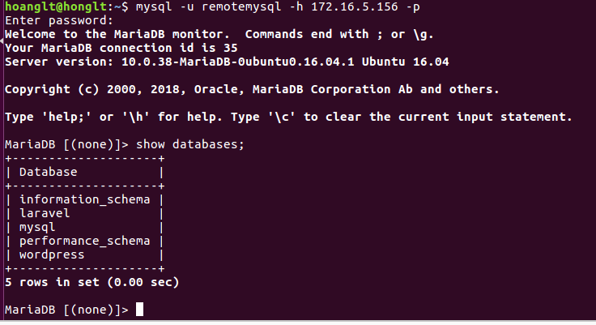
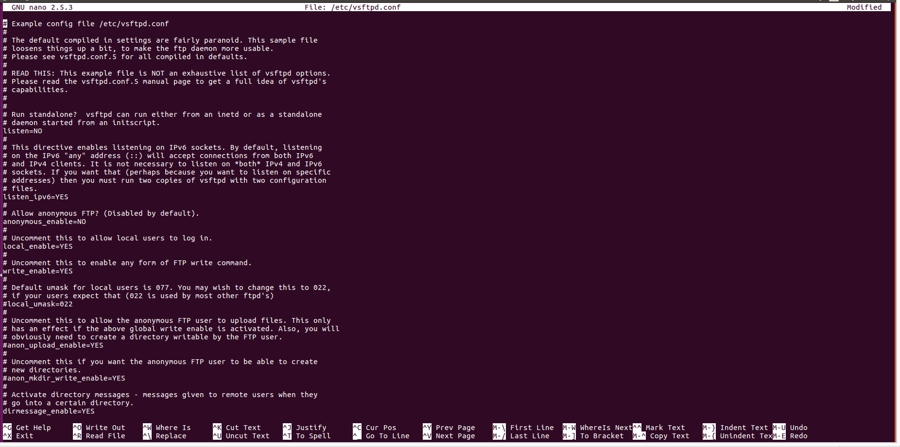

1. <a href='#1'> Reverse proxy
2. <a href='#1'> Mysql
3. <a href='#1'> vsftpd
4. <a href='#1'> phpmyadmin
5. <a href='#1'>

  
# 1. Reverse proxy

* Install nginx on ubuntu to setup reverse proxy:
  * sudo apt install nginx -y
* Set up reverser proxy on nginx

* Check log on reverproxy when login two domain on web browser

## 2. Mysql 
* By default, this value is set to **127.0.0.1**, which means the server will only look for connections locally. You need to change this market only to refer to an external IP address. 
* Edit file config in **sudo nano /etc/mysql/mariadb.conf.d/50-server.cnf**
* Change the ip local 127.0.0.1 to ip_server_mysql or 0.0.0.0

* Create user for remote mysql 
  * **sudo mysql -u root -p**
  * > CREATE USER 'user'@'remote_server_ip' IDENTIFIED BY 'password';
  * > GRANT ALL on *.* TO 'user'@'remote_server_ip' WITH GRANT OPTION;
  * > FLUSH PRIVILEGES;
  * > exit

* Open port 3306 - the port default of MySQL - which to allow traffic to MySQL
  * sudo ufw allow from remote_IP to any port 3306
  * sudo ufw allow 3306

* Check the remote database on client by commned
  * **mysqp -u user -h database_server_ip -p**

# 3. Vsftpd
* Install vsftpd by command: **sudo apt-get install vsftpd**

* Creat the file backup and edit finf vsftpd.conf by command:
  * sudo cp /etc/vsftpd.conf /etc/vsftpd.conf.bak
  * sudo nano /etc/vsftpd.conf
    * anonymous_enable=NO
    * local_enable=YES
    * write_enable=YES
    * allow_writeable_chroot=YES
    * chroot_local_user=YES
    * local_umask=022 
    * userlist_deny=NO
    * userlist_enable=YES
    * userlist_file=/etc/vsftpd.allowed_users 

* Create the files to allow user coonect ftp :
    *  sudo touch /etc/vsftpd.allowed_users 
* Add user for FTP:
  * sudo useradd ftpuser
  * sudo passwd 123
* Add user to file user_list to access: 
  * echo 'ftpuser' | sudo tee -a /etc/vsftpd.allowed_users
* Creat a folder for the new user
  * sudo mkdir -p /home/ftpuser/ftp/test
  * sudo chmod 550 /home/ftpuser/ftp/
  * sudo chmod 750 /home/ftpuser/ftp/test
  * sudo chown -R ftpuser: /home/ftpuser/ftp/

* Edit the firewall to open port 20 21 to accept connect with ftp

* Restart and check status of vsftpd
  * sudo systemctl restart vsftpd
  * sudo systemctl status vsftpd

* Open the client and test connect with ftp server
  * ftp -p <ip server>

# 4. Phpmyadmin
* Creat user for phpmyadmin on databases mysql
  * > CREATE DATABASE phpmyadmin;
  * > GRANT ALL PRIVILEGES on phpmyadmin.* TO 'phpmyadmin'@'localhost' IDENTIFIED BY 'hoanglt';
  * > FLUSH PRIVILEGES;
  * > exit

* Install phpmyadmin by command: **sudo apt install phpmyadmin**

* Config alias document root for phpmyadmin to allow login on web browser 

* This is the result after install and set up phpmyadmin

* Set up user and group for web laravel and wordpress 
  * In file config of web server laravrel:  wirte the content **AssignUserId: laravel laravel** into the file /etc/apache2/site-available/laravel.conf

  * In file config of web server wordpress:  wirte the content **AssignUserId: wordpress wordpress** into the file /etc/apache2/site-available/wordpress.conf

* To check the result after set up the config, in the document root of web server, creat the file **info.php** and write down the content below to: 
  *  *'<php?
    system("id");
    ?>'*

* On the web browser enter a format domain/info.php to check the result:

